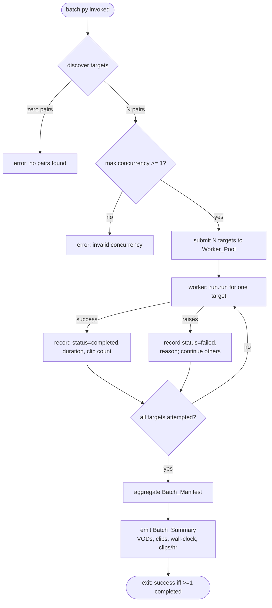
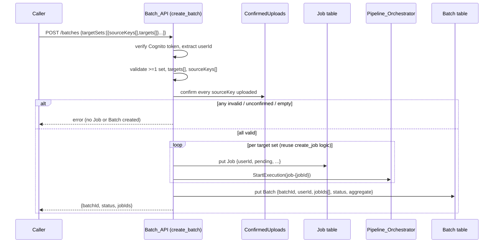
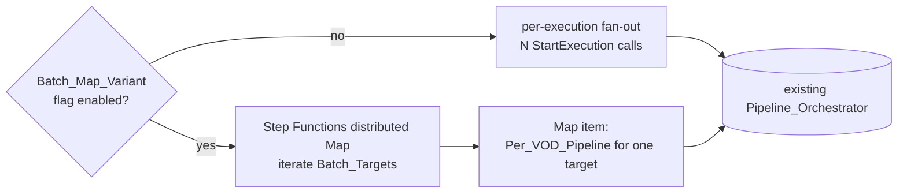

# Design Document: Batch Processing

## Overview

Batch processing lets the system handle multiple VODs in one request instead of the
single-VOD flow that exists today. It is delivered as two complementary surfaces that
reuse existing building blocks rather than reworking them:

1. **Local batch orchestrator CLI** (`pipeline/batch.py`) — discovers `(video,
   chat-log)` pairs from a directory, prefix, or explicit manifest, then runs the
   existing Per_VOD_Pipeline (`pipeline.run.run()`) over each pair inside a bounded
   worker pool. Each per-VOD run stays resumable/idempotent (it already skips stages
   whose outputs exist), so the batch layer never re-derives finished work and one
   failing VOD never aborts the batch. It aggregates an `out/batch_manifest.json` and a
   machine-readable Batch_Summary (VODs, total clips, wall-clock, clips/hr) that the
   separate Metrics spec will consume.

2. **Backend fan-out API** — `POST /batches` validates N target sets, creates N `Job`
   records reusing the exact `create_job.py` per-child logic, starts N existing
   `Pipeline_Orchestrator` executions, and persists one `Batch` record tying them
   together. `GET /batches/{batchId}` aggregates child-Job statuses and clip counts.
   Fanning out at the API layer (N executions under one Batch) is the lowest-risk way to
   demonstrate parallelism without restructuring the per-job state machine.

Design goals and constraints:

- **Reuse, don't restructure.** The per-VOD pipeline (`run.run()`) and the per-job
  `Pipeline_Orchestrator` are unchanged; batch code sits strictly *above* them. Child
  Job creation reuses `create_job.py`'s validation and `StartExecution` logic so the
  batch path and the single-job path can never diverge.
- **Config over redeploy.** Worker-pool concurrency and batch defaults are read from
  configuration (mirroring `config/weights.json`), never hard-coded literals.
- **Owner-scoping from day one.** Every Batch_API route sits behind the Cognito
  authorizer; every Batch and child Job is stamped with the caller's `userId`, and
  batch-status reads are owner-scoped exactly as `highlights_api/list_clips.py` scopes
  clip reads.
- **Failure isolation + resumability** mirror `run.py`: a batch is a supervisor over
  independent, individually-resumable units.
- **No new AWS services.** Only Step Functions, DynamoDB, and Lambda — already in the
  stack — are used. The `Batch` table is added to `StorageStack`; IAM grants are added
  in `ApiStack`.
- **Machine-readable output is a contract.** The aggregate Batch_Manifest feeds a
  downstream Metrics spec, so its schema is pinned under `docs/contracts/` and documented
  in `INTEGRATION_CONTRACT.md`.

Out of scope: the single-VOD detection/scoring/render algorithm, the internal stages of
`Pipeline_Orchestrator`, and all React/frontend work (the batch dashboard is deferred as
`[QUEUED — frontend]`). The optional Step Functions distributed-`Map` variant
(`Batch_Map_Variant`) is specified as an additive, flag-gated scalability demonstration
that never replaces the per-execution path.

## Architecture

### High-level system

```mermaid
flowchart TB
    subgraph Local["Local CLI (pipeline/)"]
        BatchCLI[batch.py<br/>Batch_Orchestrator]
        Discover[discover pairs<br/>dir / prefix / manifest]
        Pool[bounded Worker_Pool]
        RunN[run.run per VOD<br/>Per_VOD_Pipeline]
        Manifest[(out/batch_manifest.json<br/>+ Batch_Summary)]
        BatchCLI --> Discover --> Pool --> RunN --> Manifest
    end

    subgraph Client["Caller (API consumer)"]
        Create[POST /batches]
        Status[GET /batches/&#123;batchId&#125;]
    end

    subgraph API["API Gateway (Cognito authorizer)"]
        REST[REST API]
    end

    subgraph Lambdas["Batch_API Lambdas"]
        CreateFn[create_batch.py]
        StatusFn[get_batch.py]
    end

    subgraph Existing["Existing backend (unchanged)"]
        JobLogic[create_job logic<br/>validate + StartExecution]
        SFN[Pipeline_Orchestrator<br/>N executions]
    end

    subgraph Data["Storage (DynamoDB)"]
        BatchT[(Batch table)]
        JobT[(Job table)]
        ClipT[(Clip table)]
        UploadsT[(ConfirmedUploads table)]
    end

    Create --> REST --> CreateFn
    Status --> REST --> StatusFn
    CreateFn -->|per child| JobLogic --> SFN
    CreateFn --> JobT
    CreateFn --> UploadsT
    CreateFn --> BatchT
    StatusFn --> BatchT
    StatusFn --> JobT
    StatusFn --> ClipT
```



The local CLI and the backend fan-out are independent surfaces; both sit above the same
two reused primitives (`run.run()` locally, `Pipeline_Orchestrator` in the cloud).

### Local batch orchestration flow



The Worker_Pool caps concurrent `run.run()` invocations at the configured maximum. Each
worker is fully isolated: an exception is captured, recorded as a `failed` manifest
entry with a reason, and never propagated to sibling targets.

### Backend batch-create sequence



### Optional distributed-Map variant (flag-gated)



The `Batch_Map_Variant` is additive: when its flag is off, the backend behaves exactly as
Requirement 7 specifies (per-execution fan-out). It is documented for the Req 5
architecture slide and never removes the working path.

## Components and Interfaces

### Local CLI: `pipeline/batch.py` (Batch_Orchestrator)

Pure-logic functions (unit- and property-testable without I/O) plus a thin CLI wrapper:

| Function | Responsibility | Requirements |
|---|---|---|
| `discover_targets(source)` | Given a directory/prefix or an explicit manifest, return the ordered list of `Batch_Target(stream_id, video_path, chat_log_path)`; exclude videos with no matching chat-log stem and report excluded stream ids | 2.1, 2.2, 2.3, 2.4, 2.5 |
| `resolve_concurrency(cli_value, config)` | Return the effective max concurrency: the CLI value if given, else the configured default; error if `< 1` | 3.3, 3.4 |
| `run_batch(targets, max_workers, outdir)` | Submit each target to a bounded pool running `run.run(...)`; collect a per-target `TargetResult(status, duration_s, clip_count, reason?)`; failure-isolated | 3.1, 3.2, 3.5, 4.1, 5.1, 5.2, 5.3, 5.4 |
| `count_clips(target_outdir)` | Count clips produced for one target (from that target's `run.run()` output, e.g. its emitted `clips.json`/`manifest.json`) | 6.2 |
| `build_manifest(results, wall_clock_s)` | Aggregate `TargetResult`s into the Batch_Manifest dict (per-target entries + batch totals) | 1.4, 1.5, 6.1, 6.3, 6.4 |
| `build_summary(manifest)` | Derive the Batch_Summary (VODs, total clips, wall-clock, clips/hr with zero-guard) from the manifest | 11.1, 11.2, 11.4 |
| `write_outputs(manifest, summary, outdir)` | Write `batch_manifest.json` to a deterministic path and emit the machine-readable summary | 1.6, 4.3, 11.3 |
| `main(argv)` | Parse args (`--input-dir` / `--manifest`, `--max-workers`, `--outdir`), orchestrate the above, set the batch-level exit status | 3.4, 4.2, 5.4 |

`run_batch` invokes the existing `pipeline.run.run(...)` per target (constructing the same
argument vector `run.py` accepts: `--video`, `--chat-log`, `--stream-id`, `--outdir`, plus
the shared `--s3-bucket`). Each target gets its own output subdirectory so per-target
outputs and clip counts never collide, and the Per_VOD_Pipeline's own stage-skipping
provides resumability for free.

### Backend: `backend/lambdas/batch_api/`

**`create_batch.py`** — `POST /batches`
- Request: `{targetSets: [{sourceKeys: string[], targets: string[]}, ...]}`.
- Verifies the Cognito token via the API Gateway authorizer and extracts `userId` from the
  request context (never from the body), mirroring `create_job.py` and `list_clips.py`.
- Rejects the request (no Job/Batch created) if: zero target sets (Req 7.7); any set's
  `targets[]` is missing/empty/not a subset of `{"tiktok","reels","shorts"}` (Req 7.5); or
  any `sourceKeys[]` entry is unconfirmed in the ConfirmedUploads table (Req 7.6).
- For each valid set, reuses `create_job.py`'s child-creation logic — a shared helper
  (extracted from the existing handler) that writes the `Job` record and calls
  `StartExecution` — so batch children and single jobs are created identically.
- Persists one `Batch` record with `jobIds[]` = the created job ids, `userId`, `status`,
  `createdAt`, and an initial `aggregate`.
- If any child `StartExecution` fails, sets the Batch `status` to `failed` and returns an
  error (Req 7.8), consistent with `create_job.py`'s dangling-job handling.
- Response: `{batchId, status, jobIds}`.

**`get_batch.py`** — `GET /batches/{batchId}`
- Owner-scoped: loads the Batch by `batchId`; if it does not exist or its `userId` is not
  the caller's, returns an authorization/not-found error (Req 9.5) — the same shape as
  `get_owned_job` ownership checks.
- Reads each child Job's status and clip count, aggregates them, and derives the reported
  Batch `status`: `completed` iff all children completed; `failed` if ≥1 failed and none
  pending/in-progress; otherwise `in_progress` (Req 8.2, 8.3, 8.4).
- Response: `{batchId, status, jobs: [{jobId, status, clipCount}], clipsTotal}`.

**Shared utilities reused:** `lambdas/common/auth` (`user_id_from_rest_event`),
`lambdas/common/responses` (`ok`/`error`), `lambdas/common/ddb` table accessors, and the
extracted child-job helper from `job_api`.

### Infra wiring

- **`StorageStack`**: add a `batch_table` (PK `batchId`), following the existing
  `PAY_PER_REQUEST` + `RemovalPolicy.DESTROY` pattern; expose it as `self.batch_table`.
- **`app.py`**: pass `batch_table=storage_stack.batch_table` into `ApiStack`.
- **`ApiStack`**: create the two Batch Lambdas via the existing `_py_fn` helper; wire
  `POST /batches` and `GET /batches/{batchId}` behind the Cognito authorizer via the
  existing `_authed` helper; grant `batch_table` read/write to `create_batch`, read to
  `get_batch`, Job/Clip read to `get_batch`, Job read/write + ConfirmedUploads read to
  `create_batch`, and `state_machine.grant_start_execution(create_batch_fn)`.

## Data Models

### DynamoDB: Batch table (PK `batchId`)

```
batchId: string (uuid)
userId: string (Cognito sub)
jobIds: string[]                 // the child Job ids created for this batch
status: "pending" | "in_progress" | "completed" | "failed"
createdAt: string (ISO 8601)
aggregate: {
  jobs: number                   // == length(jobIds)
  clipsTotal: number             // sum of child-Job clip counts
  // additional rolled-up counts MAY be added (e.g. completed, failed)
}
```

The child `Job` records are the existing shape (`jobId, userId, status, targets[],
sourceKeys[], createdAt`) — batch creation does not change the Job schema.

### API contract: batch-create (wire shape)

```json
{
  "targetSets": [
    { "sourceKeys": ["raw/u/j1/6910008_video.mp4"], "targets": ["tiktok", "reels"] },
    { "sourceKeys": ["raw/u/j2/3654414_video.mp4"], "targets": ["shorts"] }
  ]
}
```
Response:
```json
{ "batchId": "b-1", "status": "pending", "jobIds": ["job-a", "job-b"] }
```

### API contract: batch-status (wire shape)

```json
{
  "batchId": "b-1",
  "status": "in_progress",
  "jobs": [
    { "jobId": "job-a", "status": "completed", "clipCount": 5 },
    { "jobId": "job-b", "status": "in_progress", "clipCount": 0 }
  ],
  "clipsTotal": 5
}
```

### Batch_Manifest (`out/batch_manifest.json`) and Batch_Summary

```json
{
  "targets": [
    { "streamId": "6910008", "status": "completed", "durationSeconds": 512.4, "clipCount": 5 },
    { "streamId": "3654414", "status": "failed", "durationSeconds": 41.0, "clipCount": 0,
      "reason": "transcribe job failed" }
  ],
  "excludedStreamIds": [],
  "totals": { "targets": 2, "clipsTotal": 5, "wallClockSeconds": 553.4 },
  "summary": { "vods": 2, "clipsTotal": 5, "wallClockSeconds": 553.4, "clipsPerHour": 32.5 }
}
```

- `targets[].status` is exactly one of `completed` | `failed` (Req 1.4).
- `totals.clipsTotal` == sum of `targets[].clipCount` (Req 6.3); `totals.wallClockSeconds`
  is the elapsed time from first-target-start to last-target-completion (Req 6.4).
- `summary.clipsPerHour` == `clipsTotal / (wallClockSeconds / 3600)`, reported as `0` when
  `wallClockSeconds == 0` (Req 11.4).
- The JSON schema (`docs/contracts/batch_manifest.schema.json`) and a validating example
  (`docs/contracts/batch_manifest.example.json`) pin this shape for the Metrics spec
  (Req 1.7), and `INTEGRATION_CONTRACT.md` documents the Batch record and both endpoints
  (Req 1.8).

## Correctness Properties

*A property is a characteristic or behavior that should hold true across all valid executions of a system—essentially, a formal statement about what the system should do. Properties serve as the bridge between human-readable specifications and machine-verifiable correctness guarantees.*

The batch layer is pure supervisory logic over reused primitives (discovery, aggregation,
concurrency bounding, validation, ownership scoping), so it is well suited to
property-based testing with `run.run()`, DynamoDB, and Step Functions mocked. Infra
wiring (Batch table, IAM grants, the optional Map variant) is verified with CDK synth
assertions rather than properties (see Testing Strategy).

### Property 1: Batch_Manifest JSON round-trip

For any Batch_Manifest produced by `build_manifest`/`build_summary`, decoding the JSON
encoding of the manifest SHALL produce a value equal to the original manifest.

**Validates: Requirements 1.6, 11.3**

### Property 2: Batch_Manifest shape and target coverage

For any set of per-target results fed to `build_manifest`, the resulting manifest SHALL
contain exactly one entry per target, each entry SHALL have a target identifier, a status
that is exactly one of `completed` or `failed`, a wall-clock duration in seconds, and a
clip count, and the manifest SHALL contain batch-level totals for target count, total clip
count, and total wall-clock duration.

**Validates: Requirements 1.4, 1.5, 3.5, 5.3, 6.1**

### Property 3: Directory discovery pairs by shared stream-id stem

For any set of video and chat-log file names in a directory, `discover_targets` SHALL
return exactly one Batch_Target for each video whose stream-id stem matches a chat-log
stem, each target's identifier SHALL equal that video's stream-id stem, and every video
with no matching chat-log stem SHALL appear in the excluded stream ids and SHALL NOT appear
as a target.

**Validates: Requirements 2.1, 2.3, 2.4**

### Property 4: Explicit-manifest discovery fidelity

For any explicit input manifest of pairs, `discover_targets` SHALL return Batch_Targets
whose set of pairs equals exactly the pairs listed in the manifest.

**Validates: Requirements 2.2**

### Property 5: Concurrency resolution precedence

For any command-line concurrency value and any configured concurrency default,
`resolve_concurrency` SHALL return the command-line value when one is supplied and the
configured value otherwise.

**Validates: Requirements 3.3**

### Property 6: Concurrency bound is never exceeded

For any set of Batch_Targets and any configured maximum concurrency of at least 1, the
number of Per_VOD_Pipeline invocations running simultaneously SHALL never exceed the
configured maximum.

**Validates: Requirements 3.2**

### Property 7: Failure isolation and completeness

For any set of Batch_Targets and any subset designated to fail, running the batch SHALL
record a `failed` status with a non-empty reason for exactly the failing targets, a
`completed` status for every other target, and SHALL produce a manifest with exactly one
entry per target regardless of the success/failure mix.

**Validates: Requirements 5.1, 5.2, 5.3, 6.1**

### Property 8: Clip-count aggregation

For any assignment of produced clip counts to Batch_Targets, each manifest entry's clip
count SHALL equal its target's produced clip count and the manifest's total clip count
SHALL equal the sum of the per-target clip counts.

**Validates: Requirements 6.2, 6.3, 1.3**

### Property 9: Batch-create fan-out mapping

For any list of N valid target sets submitted by an authenticated caller, the Batch_API
SHALL create exactly N Job records each stamped with the caller's identity, start exactly
one Pipeline_Orchestrator execution per created Job, and persist exactly one Batch record
stamped with the caller's identity whose `jobIds[]` equals exactly the created Job
identifiers.

**Validates: Requirements 7.2, 7.3, 7.4, 9.3, 9.4, 10.5**

### Property 10: Batch-create validation gate

For any batch-create request in which at least one target set has a `targets[]` value that
is missing, empty, or not a subset of `{"tiktok","reels","shorts"}`, or references at least
one source key that was never confirmed as uploaded, the Batch_API SHALL reject the request
without creating any Job or Batch record, and for an unconfirmed-source rejection the error
SHALL name the unconfirmed source keys.

**Validates: Requirements 7.5, 7.6**

### Property 11: Batch-status ownership and status derivation

For any Batch with any vector of child-Job statuses, a batch-status request SHALL return
the Batch's data — including per-child statuses and a clip total equal to the sum of child
clip counts — if and only if the requester's identity equals the Batch's `userId`;
otherwise it SHALL return an authorization/not-found error without returning any data. When
data is returned, the reported Batch status SHALL be `completed` if and only if every child
Job is completed, `failed` if at least one child failed and none are pending or in progress,
and `in_progress` while any child is pending or in progress.

**Validates: Requirements 8.1, 8.2, 8.3, 8.4, 9.5**

### Property 12: Batch_Summary derivation

For any Batch_Manifest, the derived Batch_Summary's VOD count SHALL equal the manifest
target count, its total clip count SHALL equal the manifest total clip count, its
wall-clock duration SHALL equal the manifest total wall-clock duration, and its
clips-per-hour throughput SHALL equal `clipsTotal / (wallClockSeconds / 3600)` when
`wallClockSeconds` is greater than zero and SHALL equal zero when `wallClockSeconds` is
zero.

**Validates: Requirements 11.1, 11.2, 11.4**

### Property 13: Idempotent manifest target identifiers

For any set of Batch_Targets processed twice against the same output location, the two
resulting manifests SHALL contain the same set of target identifiers.

**Validates: Requirements 4.2**

## Error Handling

| Failure | Handling |
|---|---|
| Discovery finds zero pairs | `batch.py` returns a "no input pairs found" error and starts no `run.run()` invocation (Req 2.5). |
| Video with no matching chat-log | Excluded from targets and recorded under `excludedStreamIds` in the manifest (Req 2.3). |
| Configured/CLI concurrency `< 1` | `resolve_concurrency`/`main` returns an invalid-concurrency error and starts nothing (Req 3.4). |
| One target's `run.run()` raises | Worker captures the exception, records `{status: "failed", reason}` for that target, and continues the remaining targets (Req 5.1, 5.2). |
| All targets fail | Manifest still written for every target; batch-level exit status is non-successful (Req 5.3, 5.4). |
| Re-run over existing outputs | Batch layer performs no deletion/overwrite; per-VOD stage-skipping handles resumption (Req 4.1). |
| Total wall-clock is zero | Batch_Summary reports `clipsPerHour: 0` instead of dividing by zero (Req 11.4). |
| `POST /batches` unauthenticated/expired token | API returns an authorization error; no Job or Batch created (Req 9.1, 9.2). |
| `POST /batches` zero target sets | Rejected with a "≥1 target set required" error; nothing created (Req 7.7). |
| `POST /batches` invalid `targets[]` | Rejected with an invalid-targets error; no Job or Batch created (Req 7.5). |
| `POST /batches` unconfirmed source keys | Rejected with an error naming the unconfirmed keys; no Job or Batch created (Req 7.6). |
| `StartExecution` fails for a child Job | Batch `status` set to `failed`; error returned indicating the batch could not be fully started (Req 7.8). |
| `GET /batches/{batchId}` not owned/nonexistent | Authorization/not-found error; no status data returned (Req 9.5). |

## Testing Strategy

**Dual approach**: property-based tests cover the 13 universal properties above across
randomized inputs; unit/integration tests cover specific examples, error paths, and infra
wiring that do not vary meaningfully with input.

**Property-based tests**:
- Library: **Hypothesis** (Python), matching the repo's existing backend/pipeline test
  stack — not implemented from scratch.
- Each property test runs a minimum of **100 iterations**.
- Each test is tagged with a comment referencing its design property, format:
  **Feature: batch-processing, Property {number}: {property text}**.
- Each of the 13 properties above is implemented as exactly one property-based test.
- I/O is mocked so iteration stays cheap: `run.run()` is replaced with an instrumented
  fake (records invocation, peak concurrency, and controllable success/failure) for the
  CLI properties (P2, P3, P4, P6, P7, P8, P13); DynamoDB and Step Functions clients are
  mocked for the backend properties (P9, P10, P11). Pure functions (P1 round-trip, P5
  concurrency resolution, P12 summary derivation) need no mocks.

**Unit/integration tests** (representative examples, not exhaustive iteration):
- Empty-discovery and invalid-concurrency edge cases (Req 2.5, 3.4) — 1-2 examples each,
  since behavior does not vary with input beyond the boundary.
- Resume/no-overwrite example (Req 4.1): pre-populate a target's outputs, re-run with a
  mocked `run.run()`, assert the batch layer deletes/overwrites nothing.
- Deterministic manifest write path (Req 4.3): assert the output path.
- `StartExecution`-failure example (Req 7.8): mock the client to raise, assert the Batch is
  marked `failed` and an error is returned.
- Auth-gate examples (Req 7.1, 9.1, 9.2): unauthenticated events return an authorization
  error with no side effects.
- `docs/contracts/` schema + example validation (Req 1.7): one test asserting the example
  Batch_Manifest validates against the schema.

**CDK synth assertions** (infra, not PBT — the Batch feature is IaC at this layer):
- Batch table exists with PK `batchId` (Req 10.1).
- `create_batch` has Batch read/write, Job read/write, ConfirmedUploads read, and
  `states:StartExecution`; `get_batch` has Batch read and Job/Clip read (Req 10.2, 10.3,
  10.4).
- No new AWS service resource types are introduced by the batch constructs; the optional
  `Batch_Map_Variant`, when defined, contains a distributed `Map` over targets and does not
  remove the per-execution wiring (Req 10.6, 12.1, 12.3, 12.4).

**Presence/smoke checks** (documentation and scope markers, not executable logic):
- `INTEGRATION_CONTRACT.md` documents the Batch record and both endpoints (Req 1.8).
- The batch-capability section (Req 14.1) and fan-out scalability narrative (Req 14.2) are
  present.
- The batch dashboard is documented as deferred `[QUEUED — frontend]` and not implemented
  (Req 13.1).
