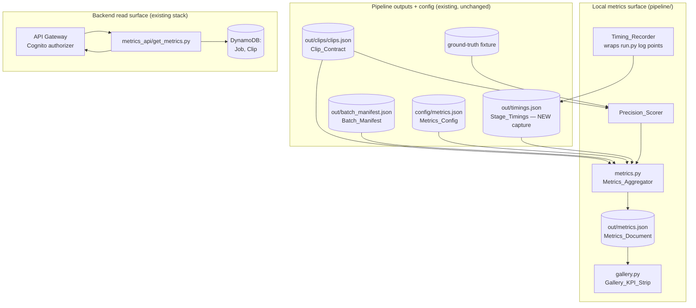
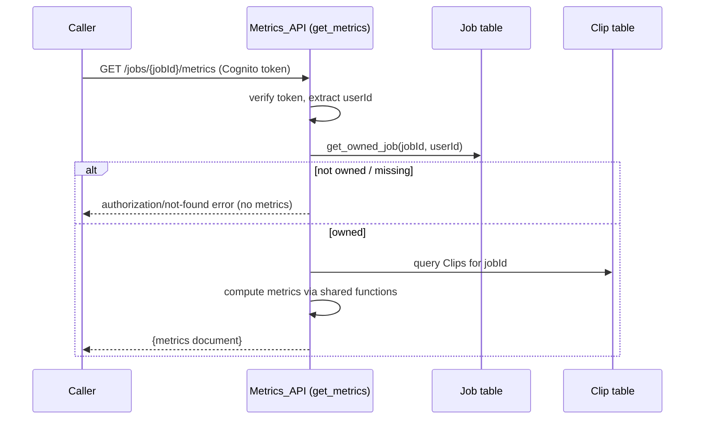

# Design Document: Performance & ROI Metrics

## Overview

This feature computes the quantitative performance indicators hackathon deliverable
Req 6 asks for, derived from data the pipeline already emits plus a minimal new
per-stage timing capture. It sits strictly *above* the existing detection/render
pipeline and the backend read layer — it reads their outputs and configuration and
produces one machine-readable `out/metrics.json`, then exposes that document through
two surfaces (the standalone HTML gallery and a backend read endpoint).

The indicators are: editing-time-saved %, automation level, throughput (clips/hour),
cost per VOD, detection precision (against a small labeled ground-truth set), an
output quality score (from virality scores + cross-modal agreement), and
clearly-labeled monetization and content-reuse **projections**.

Five building blocks, in dependency order:

1. **Metrics config + schema (shared foundation)** — `config/metrics.json` (mirroring
   `config/weights.json`) holds every tunable: editor-minutes-per-clip, the cost
   model, platform RPM, quality weights, precision parameters, and projection
   assumptions. A JSON schema + validating example for the Metrics_Document is pinned
   under `docs/contracts/`, and `INTEGRATION_CONTRACT.md` documents the document, the
   config, and the endpoint.
2. **Stage-timing capture** — a non-invasive `Timing_Recorder` wraps the existing
   `log()` points in `pipeline/run.py` and persists per-stage start/end to
   `out/timings.json`. Stage logic is untouched.
3. **Ground-truth fixture + precision scorer** — the known highlight windows from
   `README.md` (VOD `6910008`: 27:25 / 62:35 / 45:00 / 83:45) are committed as a
   fixture; `Precision_Scorer` computes precision@k and temporal IoU overlap of
   detected clips vs labeled windows.
4. **Metrics aggregator** — `pipeline/metrics.py` reads Stage_Timings, the
   Clip_Contract (`clips.json`), the Batch_Manifest, and `config/metrics.json`, and
   writes `out/metrics.json` with every indicator.
5. **Consumption surfaces** — a KPI header strip in the standalone `pipeline/gallery.py`
   HTML, and an owner-scoped `GET /jobs/{jobId}/metrics` backend endpoint (plus an
   optional batch metrics route).

Design goals and constraints:

- **Reuse, don't restructure.** The detection/render pipeline, `contracts.py`'s
  `clips.json`, the batch-processing spec's `batch_manifest.json`, and the backend
  read layer are unchanged; metrics code sits above them. `Timing_Recorder` only wraps
  `run.py`'s existing `log()` calls.
- **Config over redeploy.** Every heuristic and assumption (editor-minutes-per-clip,
  cost model, platform RPM, quality weights, precision parameters, projection
  assumptions) is read from `config/metrics.json`, never hard-coded — mirroring
  `config/weights.json`.
- **Projections are labeled.** Monetization and content-reuse figures are marked as
  projections carrying their assumption values, never presented as measured.
- **Build-order dependency on batch-processing.** Batch-level aggregates consume the
  batch-processing spec's `out/batch_manifest.json` + Batch_Summary; that schema is
  already pinned under `docs/contracts/`.
- **Owner-scoping from day one.** The Metrics_API route sits behind the Cognito
  authorizer and is owner-scoped exactly as `highlights_api/list_clips.py` scopes clip
  reads via `get_owned_job`.
- **No new AWS services.** Only API Gateway, Lambda, and DynamoDB — already in the
  stack — are used.

Out of scope: the single-VOD detection/scoring/render algorithm, the batch
orchestration itself, any new AWS service integration, and all React/frontend work.
The frontend metrics panel is deferred as `[QUEUED — frontend]` and must not be
touched here.

## Architecture

### High-level system



The local aggregator and the backend endpoint are independent surfaces over the same
computation logic. The local surface computes from files on disk; the backend endpoint
derives per-job metrics from the Job/Clip data already in DynamoDB (owner-scoped),
sharing the pure metric-computation functions with `pipeline/metrics.py`.

### Local aggregation flow

```mermaid
flowchart TB
    Start([metrics.py invoked]) --> Load[load Metrics_Config]
    Load --> Clips{clips.json present?}
    Clips -->|no| ErrClips[error: clip contract required]
    Clips -->|yes| ReadClips[read Clip_Contract]
    ReadClips --> Timings{timings.json present?}
    Timings -->|yes| TimingMetrics[compute editing-time-saved,<br/>automation level, clips/hour]
    Timings -->|no| OmitTiming[omit timing-derived indicators]
    TimingMetrics --> Quality
    OmitTiming --> Quality[compute quality score]
    Quality --> Cost[compute cost per VOD]
    Cost --> Fixture{fixture for this VOD?}
    Fixture -->|yes| Precision[Precision_Scorer:<br/>precision@k + IoU]
    Fixture -->|no| OmitPrec[omit precision indicator]
    Precision --> Proj
    OmitPrec --> Proj[compute labeled projections]
    Proj --> BatchQ{batch manifest supplied?}
    BatchQ -->|yes| BatchAgg[include batch aggregates]
    BatchQ -->|no| OmitBatch[omit batch aggregates]
    BatchAgg --> Write[write out/metrics.json]
    OmitBatch --> Write
    Write --> Done([exit])
```

Every optional input degrades gracefully: an absent Stage_Timings omits the
timing-derived indicators, an absent fixture omits precision, and an absent
Batch_Manifest omits batch aggregates — a Metrics_Document is always written with
whatever could be computed.

### Backend metrics-read sequence



## Components and Interfaces

### Timing capture: `Timing_Recorder` in `pipeline/run.py`

A minimal helper wrapping the existing `log()` points; it records a stage's start when
the stage begins and its end when the stage finishes, then writes `out/timings.json` at
the end of `run()`.

| Function | Responsibility | Requirements |
|---|---|---|
| `record_stage(name)` (context manager) | Capture `name`, start timestamp on enter, end timestamp on exit; append a `StageTiming` entry | 2.1, 2.2, 2.5 |
| `write_timings(entries, outdir)` | Write the collected `StageTiming` entries as JSON to `out/timings.json` | 2.3 |

`record_stage` is a thin wrapper: each existing `log("stage: ...")` point is bracketed
so stage logic is unmodified (Req 2.4). A stage skipped because its output already
exists is recorded with `start == end` (zero-length duration) rather than omitted
(Req 2.5).

### Precision scoring: `Precision_Scorer` (in `pipeline/metrics.py` or a helper module)

Pure functions over windows and rankings (no I/O):

| Function | Responsibility | Requirements |
|---|---|---|
| `iou(a, b)` | Temporal IoU of two `(start, end)` windows: `intersection / union`; `0` when disjoint | 4.1, 4.4 |
| `matches(detected, labeled, threshold)` | `True` iff `iou(detected, labeled) >= threshold` | 4.2 |
| `precision_at_k(detected_ranked, labeled, k, threshold)` | Count of the top-k detected windows (ranked by `virality_score` desc) matching ≥1 labeled window, divided by `k` | 4.3, 4.4 |
| `score_precision(clips, fixture_windows, config)` | Assemble the precision indicator (precision@k + best-IoU summary) for a VOD; return `None` when no fixture windows exist | 4.5, 5.1 |

### Metrics computation: `pipeline/metrics.py` (Metrics_Aggregator)

Pure computation functions (unit- and property-testable without I/O) plus a thin CLI
wrapper and file readers:

| Function | Responsibility | Requirements |
|---|---|---|
| `load_config(path)` | Read `config/metrics.json`; expose editor-minutes-per-clip, cost model, platform RPM, quality weights, precision params, projection assumptions | 1.2 |
| `wall_clock_seconds(timings)` | Total wall-clock from first-stage start to last-stage end in Stage_Timings | 6.2, 7.1 |
| `editing_time_saved_pct(clip_count, wall_clock_s, config)` | Manual baseline = `clip_count * editorMinutesPerClip`; saved% = `(baseline - wallClockMin)/baseline * 100`; `0` when baseline is `0` | 6.1, 6.2, 6.3 |
| `automation_level(timings, config)` | `automatedStageCount / totalStageCount` (automated count from Stage_Timings, total from config); clamped to `[0, 1]` | 6.4, 6.5 |
| `clips_per_hour(clip_count, wall_clock_s)` | `clip_count / (wall_clock_s / 3600)`; `0` when wall-clock is `0` | 7.1, 7.2 |
| `cost_per_vod(config)` | Sum of the per-VOD cost-model components; carries the configured currency | 7.3, 7.4 |
| `quality_score(clips, config)` | Weighted combination of normalized mean `virality_score` and normalized mean cross-modal agreement (`len(modalities)`); in `[0, 1]`; `0` for empty clip set | 8.1, 8.2, 8.3, 8.4 |
| `monetization_projection(clip_count, config)` | Projected revenue from clip count × platform RPM × projected views; flagged as a projection with its assumptions | 9.1, 9.3, 9.4 |
| `content_reuse_projection(clip_count, source_seconds, config)` | Projected reuse (clips per source hour and reuse multiplier); flagged as a projection with its assumptions | 9.2, 9.3, 9.4 |
| `build_metrics(stream_id, clips, timings, batch, config, fixture)` | Assemble the full Metrics_Document, omitting indicators whose inputs are absent | 5.1, 5.2, 5.4, 5.5, 10.1, 10.2, 10.3 |
| `write_metrics(doc, outdir)` | Write the Metrics_Document as JSON to `out/metrics.json` | 5.3 |
| `main(argv)` | Parse args (`--clips`, `--timings`, `--batch-manifest`, `--stream-id`, `--config`, `--outdir`), orchestrate the above | 5.1, 5.2, 5.3 |

Timing-derived helpers accept `timings=None`; `build_metrics` omits their outputs when
`timings` is absent (Req 10.1), omits precision when the fixture has no windows for the
VOD (Req 4.5), and omits batch aggregates when no `batch` is supplied (Req 10.2),
always writing a document with the remaining indicators (Req 10.3).

### Gallery: `Gallery_KPI_Strip` in `pipeline/gallery.py`

`pipeline/gallery.py` is the standalone self-contained HTML gallery (NOT the React
app). It gains an optional `--metrics <path>` argument; when a Metrics_Document is
supplied, `render()` prepends a KPI header strip (or emits a companion `metrics.html`)
showing editing-time-saved %, automation level, clips/hour, cost per VOD, and quality
score, with any projection-marked value visibly labeled as a projection. When no
Metrics_Document is supplied, the existing clip gallery renders unchanged.

| Function | Responsibility | Requirements |
|---|---|---|
| `render_kpi_strip(metrics)` | Return the KPI header HTML for the five headline indicators, labeling projection values | 11.1, 11.2, 11.3 |
| `render(manifest, clips_dir, metrics=None)` | Existing gallery render, optionally prepending `render_kpi_strip(metrics)`; unchanged when `metrics is None` | 11.4 |

### Backend: `backend/lambdas/metrics_api/`

**`get_metrics.py`** — `GET /jobs/{jobId}/metrics`
- Verifies the Cognito token via the API Gateway authorizer and extracts `userId` from
  the request context (never from the body), mirroring `list_clips.py`.
- Owner-scoped: loads the Job via `get_owned_job(jobId, userId)`; on `OwnershipError`
  returns an authorization/not-found error and no metrics (Req 12.4).
- Reads the job's Clips from DynamoDB and computes the per-job metrics using the shared
  pure computation functions (the same ones `pipeline/metrics.py` uses), then returns
  the Metrics_Document (Req 12.3).
- **Optional batch route** `GET /batches/{batchId}/metrics`: owner-scoped against the
  Batch record (from the batch-processing spec) and returns batch-level aggregates only
  to the owner (Req 12.5).

**Shared utilities reused:** `lambdas/common/auth` (`user_id_from_rest_event`),
`lambdas/common/ownership` (`get_owned_job`), `lambdas/common/ddb` (Clip table
accessor), and `lambdas/common/responses` (`ok`/`error`). The pure metric-computation
functions are factored so both `pipeline/metrics.py` and the Lambda import them,
keeping the local and backend numbers identical.

### Infra wiring

- **`ApiStack`**: create the `get_metrics` Lambda via the existing `_py_fn` helper; wire
  `GET /jobs/{jobId}/metrics` (and the optional `GET /batches/{batchId}/metrics`) behind
  the Cognito authorizer via the existing `_authed` helper; grant the handler read
  access to the Clip table (and Job table via the shared ownership helper) — no new
  tables, buckets, or AWS services (Req 13.1, 13.2, 13.3).

## Data Models

### `config/metrics.json` (Metrics_Config) — mirrors `config/weights.json`

```json
{
  "editorMinutesPerClip": 45,
  "costModel": {
    "currency": "USD",
    "perVod": { "transcribe": 1.8, "rekognition": 1.0, "bedrock": 0.3, "render": 1.0 }
  },
  "workflowStages": { "automated": 7, "total": 8 },
  "qualityWeights": { "virality": 0.6, "crossModal": 0.4 },
  "precision": { "k": 5, "iouMatchThreshold": 0.3, "maxModalities": 3 },
  "platformRpm": { "tiktok": 0.4, "reels": 0.5, "shorts": 0.3 },
  "projectionAssumptions": { "projectedViewsPerClip": 5000, "reuseSourceHours": 1.5 }
}
```

### Ground_Truth_Fixture (`pipeline/fixtures/ground_truth.json`)

```json
{
  "6910008": [
    { "label": "performer entrance", "start": 1645.0, "end": 1675.0 },
    { "label": "joke landing",       "start": 2700.0, "end": 2730.0 },
    { "label": "song performance peak", "start": 3755.0, "end": 3785.0 },
    { "label": "prize announcement", "start": 5025.0, "end": 5055.0 }
  ]
}
```

Windows are keyed by stream id (Req 3.3); each `end > start` (Req 3.4); the four VOD
`6910008` windows correspond to the `README.md` timestamps 27:25, 45:00, 62:35, 83:45
(Req 3.2).

### Stage_Timings (`out/timings.json`)

```json
{
  "streamId": "6910008",
  "stages": [
    { "name": "chat",       "startS": 0.00,   "endS": 1.20 },
    { "name": "audio",      "startS": 1.20,   "endS": 44.10 },
    { "name": "transcribe", "startS": 44.10,  "endS": 512.30 },
    { "name": "fusion",     "startS": 512.30, "endS": 514.90 },
    { "name": "director",   "startS": 514.90, "endS": 690.00 },
    { "name": "render",     "startS": 690.00, "endS": 902.40 }
  ]
}
```

Every stage has `endS >= startS` (Req 2.2); a skipped stage is recorded with
`startS == endS` (Req 2.5). Wall-clock is `max(endS) - min(startS)`.

### Metrics_Document (`out/metrics.json`)

```json
{
  "streamId": "6910008",
  "clipCount": 5,
  "wallClockSeconds": 902.4,
  "editingTimeSavedPct": 66.8,
  "automationLevel": 0.875,
  "clipsPerHour": 19.9,
  "costPerVod": { "amount": 4.1, "currency": "USD" },
  "qualityScore": 0.78,
  "detectionPrecision": { "k": 5, "precisionAtK": 0.8, "meanBestIou": 0.61 },
  "projections": {
    "monetization": {
      "kind": "projection",
      "amount": 22.5, "currency": "USD",
      "assumptions": { "projectedViewsPerClip": 5000, "platformRpm": { "tiktok": 0.4 } }
    },
    "contentReuse": {
      "kind": "projection",
      "clipsPerSourceHour": 3.3, "reuseMultiplier": 5.0,
      "assumptions": { "reuseSourceHours": 1.5 }
    }
  },
  "batch": {
    "vods": 2, "clipsTotal": 10, "wallClockSeconds": 1503.4, "clipsPerHour": 23.9
  }
}
```

- `detectionPrecision` is present only when a Ground_Truth_Fixture window set exists for
  the VOD (Req 4.5); `batch` is present only when a Batch_Manifest is supplied (Req 10.2);
  the timing-derived fields (`editingTimeSavedPct`, `automationLevel`, `clipsPerHour`)
  are present only when Stage_Timings is available (Req 10.1).
- `projections.*.kind == "projection"` marks monetization and reuse as projections, and
  each carries the `assumptions` used (Req 9.3, 9.4).
- The JSON schema (`docs/contracts/metrics.schema.json`) and a validating example
  (`docs/contracts/metrics.example.json`) pin this shape (Req 1.3), and
  `INTEGRATION_CONTRACT.md` documents the document, `config/metrics.json`, and the
  endpoint (Req 1.5).

### API contract: metrics-read (wire shape)

`GET /jobs/{jobId}/metrics` returns the per-job Metrics_Document above (without the
`batch` block); `GET /batches/{batchId}/metrics` returns a document whose top level is
the `batch` aggregate block. Both are owner-scoped.

## Correctness Properties

*A property is a characteristic or behavior that should hold true across all valid executions of a system—essentially, a formal statement about what the system should do. Properties serve as the bridge between human-readable specifications and machine-verifiable correctness guarantees.*

The metrics layer is almost entirely pure computation over generated inputs (timing
folds, ratio math, IoU/precision geometry, weighted aggregates, projection formulas,
and degradation logic), so it is well suited to property-based testing with file I/O,
DynamoDB, and Step Functions mocked. Infra wiring (Lambda grants, authorizer, no new
services) is verified with CDK synth assertions rather than properties (see Testing
Strategy).

### Property 1: Metrics_Document JSON round-trip

For any Metrics_Document produced by `build_metrics`, decoding the JSON encoding of the
document SHALL produce a value equal to the original document.

**Validates: Requirements 1.4**

### Property 2: Metrics_Document shape and coverage

For any combination of present inputs (Clip_Contract always present; Stage_Timings,
Ground_Truth_Fixture window set, and Batch_Manifest each present or absent), the
Metrics_Document SHALL identify the VOD by its stream id and SHALL contain the output
quality score, the cost per VOD, the monetization projection, and the content-reuse
projection, and SHALL contain each of the editing-time-saved percentage, automation
level, and clips-per-hour throughput if and only if Stage_Timings is present, the
detection-precision indicator if and only if a fixture window set is present, and the
batch aggregates if and only if a Batch_Manifest is present.

**Validates: Requirements 5.4, 5.5, 10.1, 10.2, 10.3**

### Property 3: Stage-timing capture completeness

For any sequence of executed pipeline stages (including stages skipped because their
output already exists), Stage_Timings SHALL contain exactly one entry per executed
stage, each entry SHALL carry a stage name, a start timestamp, and an end timestamp,
each entry's end timestamp SHALL be greater than or equal to its start timestamp, and
every skipped stage SHALL be recorded with an end timestamp equal to its start timestamp.

**Validates: Requirements 2.1, 2.2, 2.5**

### Property 4: Temporal IoU correctness

For any two time windows, their temporal IoU SHALL equal the length of their
intersection divided by the length of their union, SHALL lie between 0 and 1 inclusive,
SHALL equal 1 when the two windows are identical, and SHALL equal 0 when the two windows
are disjoint.

**Validates: Requirements 4.1, 4.4**

### Property 5: Precision@k computation

For any ranked set of detected windows, any set of labeled windows, any k, and any IoU
match threshold, precision at k SHALL equal the number of the top-k detected windows
(ranked by `virality_score` descending) whose temporal IoU with at least one labeled
window is greater than or equal to the threshold, divided by k, and SHALL lie between 0
and 1 inclusive.

**Validates: Requirements 4.2, 4.3, 4.4**

### Property 6: Editing-time-saved computation

For any produced clip count, any pipeline wall-clock duration, and any
editor-minutes-per-clip heuristic, the manual editing baseline SHALL equal the clip
count multiplied by the heuristic, and the editing-time-saved percentage SHALL equal the
baseline minus the wall-clock duration divided by the baseline expressed as a
percentage when the baseline is greater than zero, and SHALL equal zero when the
baseline is zero.

**Validates: Requirements 6.1, 6.2, 6.3**

### Property 7: Automation level ratio

For any automated-stage count derived from Stage_Timings and any total-stage count from
Metrics_Config, the automation level SHALL equal the automated-stage count divided by
the total-stage count and SHALL lie between 0 and 1 inclusive.

**Validates: Requirements 6.4, 6.5**

### Property 8: Throughput and cost computation

For any produced clip count and any pipeline wall-clock duration, clips per hour SHALL
equal the clip count divided by the wall-clock duration in hours when the wall-clock
duration is greater than zero and SHALL equal zero when it is zero; and for any cost
model, the cost per VOD SHALL equal the sum of the per-VOD cost-model components and
SHALL carry the cost model's configured currency.

**Validates: Requirements 7.1, 7.2, 7.3, 7.4**

### Property 9: Quality score derivation and bounds

For any set of clips and any quality weights, the output quality score SHALL be derived
from the clips' virality scores and cross-modal agreement counts combined using those
weights, SHALL lie between 0 and 1 inclusive, and SHALL equal zero when the clip set is
empty.

**Validates: Requirements 8.1, 8.2, 8.3**

### Property 10: Quality score monotonicity

For any two clip sets of equal size where every clip in the first set has a virality
score and a cross-modal agreement count each greater than or equal to those of the
correspondingly-positioned clip in the second set, the output quality score computed for
the first set SHALL be greater than or equal to the output quality score computed for
the second set.

**Validates: Requirements 8.4**

### Property 11: Projections are derived, labeled, and carry assumptions

For any produced clip count, source duration, and Metrics_Config, the monetization
projection SHALL be derived from the clip count and the platform RPM and projection
assumptions, the content-reuse projection SHALL be derived from the clip count, the
source duration, and the projection assumptions, and both SHALL be marked in the
Metrics_Document as projections rather than measured values and SHALL record the
projection assumption values used to compute them.

**Validates: Requirements 9.1, 9.2, 9.3, 9.4**

### Property 12: Gallery KPI strip rendering completeness

For any Metrics_Document supplied to `pipeline/gallery.py`, the rendered Gallery_KPI_Strip
SHALL contain the editing-time-saved percentage, the automation level, the clips-per-hour
throughput, the cost per VOD, and the output quality score, and SHALL visibly label every
value the Metrics_Document marks as a projection.

**Validates: Requirements 11.1, 11.2**

### Property 13: Metrics endpoint ownership scoping

For any `jobId` (or `batchId`) and any authenticated user, a metrics request SHALL return
that job's (or batch's) metrics if and only if the record exists and its `userId` equals
the requester's identity; otherwise the Metrics_API SHALL return an authorization/not-found
error and SHALL NOT return any metrics.

**Validates: Requirements 12.3, 12.4, 12.5**

## Error Handling

| Failure | Handling |
|---|---|
| `clips.json` (Clip_Contract) absent | `metrics.py` returns a "clip contract required" error; the Clip_Contract is the one mandatory input. |
| Stage_Timings absent | Timing-derived indicators (editing-time-saved, automation level, clips/hour) omitted from the Metrics_Document; document still written (Req 10.1, 10.3). |
| No Batch_Manifest supplied | Batch aggregates omitted; document still written (Req 10.2, 10.3). |
| No fixture window set for the VOD | Detection-precision indicator omitted rather than fabricated (Req 4.5). |
| Manual editing baseline is zero (zero clips) | Editing-time-saved percentage reported as `0` instead of dividing by zero (Req 6.3). |
| Pipeline wall-clock is zero | Clips-per-hour reported as `0` instead of dividing by zero (Req 7.2). |
| Clip set is empty | Quality score reported as `0` instead of dividing by zero (Req 8.3). |
| No Metrics_Document available to the gallery | `gallery.py` renders the clip gallery without a KPI strip rather than erroring (Req 11.4). |
| `GET /jobs/{jobId}/metrics` unauthenticated/expired token | Metrics_API returns an authorization error; no metrics returned (Req 12.1, 12.2). |
| `jobId`/`batchId` not owned or nonexistent | Authorization/not-found error via `get_owned_job`; no metrics returned (Req 12.4, 12.5). |

## Testing Strategy

**Dual approach**: property-based tests cover the 13 universal properties above across
randomized inputs; unit/integration tests cover specific examples, error paths, fixtures,
schema validation, and infra wiring that do not vary meaningfully with input.

**Property-based tests**:
- Library: **Hypothesis** (Python), matching the repo's existing pipeline/backend test
  stack — not implemented from scratch.
- Each property test runs a minimum of **100 iterations**.
- Each test is tagged with a comment referencing its design property, format:
  **Feature: metrics-dashboard, Property {number}: {property text}**.
- Each of the 13 properties above is implemented as exactly one property-based test.
- I/O is mocked so iteration stays cheap: file readers and DynamoDB/ownership lookups are
  replaced with in-memory fakes for the aggregation and endpoint properties (P2, P3, P13);
  the pure computation properties (P1 round-trip, P4/P5 precision geometry, P6/P7/P8 metric
  math, P9/P10 quality aggregate, P11 projections, P12 rendering) need no AWS mocks.

**Unit/integration tests** (representative examples, not exhaustive iteration):
- `docs/contracts/` schema + example validation (Req 1.3): one test asserting
  `metrics.example.json` validates against `metrics.schema.json`.
- Ground_Truth_Fixture shape/content (Req 3.1, 3.2, 3.3, 3.4): assert the fixture keys by
  stream id, includes the four documented `6910008` windows, and every window has
  `end > start`.
- Config honored (Req 1.2): one example asserting a non-default `config/metrics.json`
  changes the derived numbers.
- Aggregator wiring and deterministic output paths (Req 5.1, 5.2, 5.3): examples asserting
  `out/metrics.json` is written and includes batch aggregates when a manifest is supplied.
- `precision` omitted when no fixture (Req 4.5): one example.
- Timings written to `out/timings.json` as JSON without altering stage output (Req 2.3,
  2.4): an example asserting the path/JSON and unchanged stage outputs.
- Gallery renders without a strip when no metrics document is supplied (Req 11.4): one
  example; and a self-contained-output check (Req 11.3).
- Auth-gate examples (Req 12.1, 12.2): unauthenticated/expired-token requests return an
  authorization error with no metrics.

**CDK synth assertions** (infra, not PBT — the endpoint wiring is IaC):
- The `get_metrics` Lambda has read access to the Clip table (and Job table via the shared
  ownership helper) (Req 13.1).
- The metrics route sits behind the Cognito authorizer (Req 13.3).
- No new AWS service resource types are introduced by the metrics constructs (Req 13.2).

**Presence/smoke checks** (documentation and scope markers, not executable logic):
- `INTEGRATION_CONTRACT.md` documents the Metrics_Document, `config/metrics.json`, and the
  endpoint (Req 1.5).
- The Req 6 indicator documentation wired to `metrics.json` fields (Req 15.1) and the
  projection/commercial-benefit framing (Req 15.2) are present.
- The frontend metrics panel is documented as deferred `[QUEUED — frontend]` and not
  implemented (Req 14.1).
