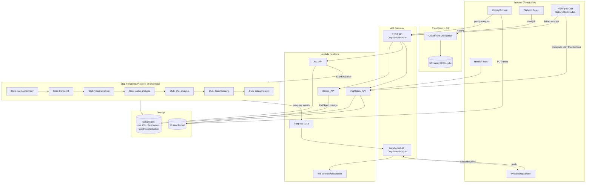
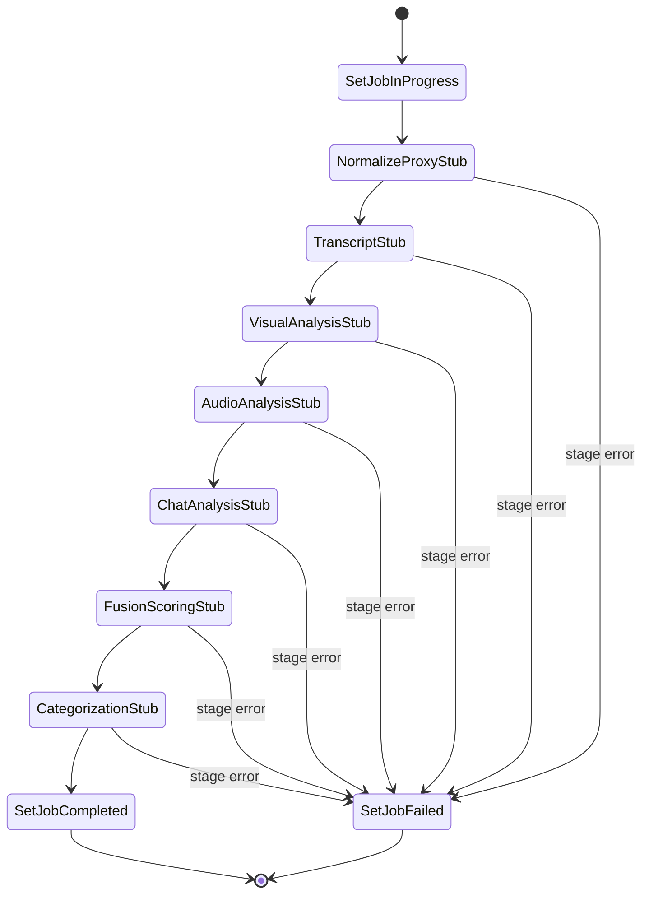
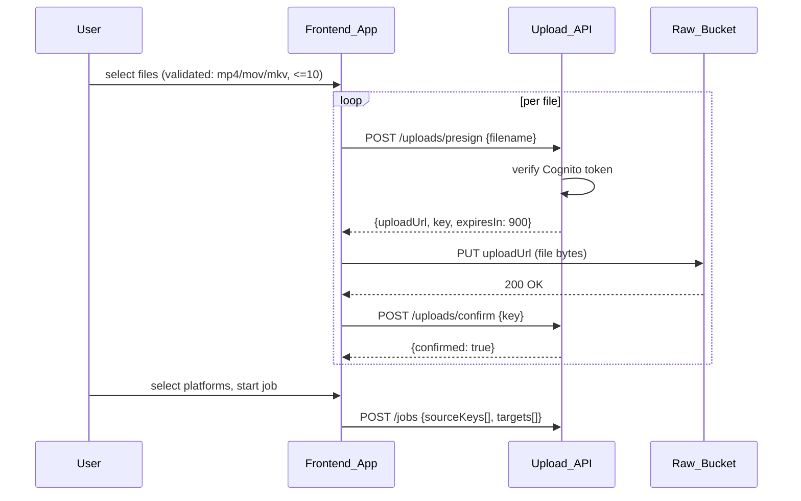
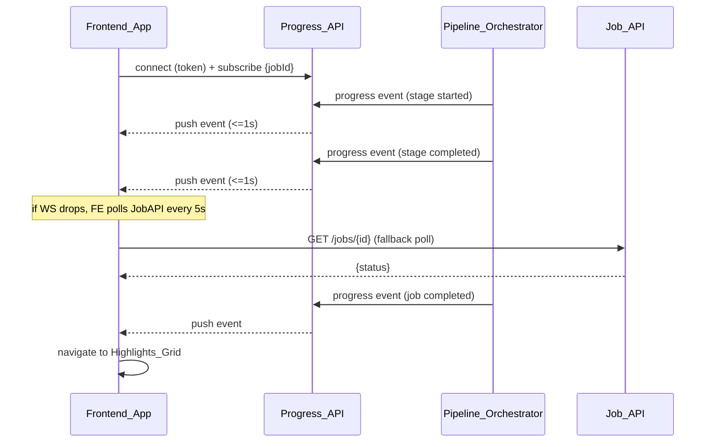

# Design Document: Webapp Skeleton

## Overview

This design wires the end-to-end **skeleton** of the Live Stream Highlight Generator:
upload → platform selection → job start → stubbed analysis pipeline → highlights
grid (Gallery + Grid view modes, sort, score details, multi-select, crop/confirm,
compilation mode, chip/freeform refinement) → confirm-and-handoff stub. Real
detection logic (MediaConvert/Transcribe/Rekognition/Bedrock/fusion scoring),
the AI auto-edit engine, and the built-in editor are out of scope; the pipeline's
analysis stages are replaced by `Analysis_Stage_Stub` steps that emit deterministic
placeholder `Clip` data matching the exact shape the real pipeline (`pipeline/`)
will eventually produce (`out/clips/gallery.html` is the shape/content reference
for the richer `Clip` fields — mood, bilingual titles, caption, hashtags, per-factor
scores — used to build the Gallery view cards).

Design goals:
- Every screen in `user-flow.md` steps 1-4 is real and navigable; steps 5-8 are
  represented by the single `Handoff_Stub` screen (Req 15.6).
- The stub pipeline is structurally identical to the real one (same stage names,
  same Step Functions shape, same `Clip` schema) so swapping in real analysis
  later requires no contract changes — only replacing Lambda bodies.
- All grid interactions are pure functions of `(clips, sortOrder, compilationMode,
  selection, viewMode)` client state, so Gallery and Grid views share one state
  model and render it two ways (Req 18.7).
- Auth, presigned URLs, and private buckets are non-negotiable from Req 3 / the
  architecture's "auth from day one" principle — every wiring decision below
  assumes a Cognito authorizer on every route.

## Architecture

### High-level system



### Step Functions state machine (stub pipeline)

Stage names match `architecture.md`'s fusion pipeline exactly, so the real
implementation can replace stub bodies stage-by-stage with no orchestration
changes (Req 6.1).



Each state (`NormalizeProxyStub` ... `CategorizationStub`) is a `Task` state
invoking one Lambda that:
1. Publishes a `{jobId, stage, status: "started"}` progress event.
2. Does its stub work (no-op for most stages; `FusionScoringStub` creates Clip
   records; `CategorizationStub` assigns `mood`/`momentType`).
3. Publishes a `{jobId, stage, status: "completed"}` progress event.
4. On unhandled exception, the ASL `Catch` routes to `SetJobFailed`, which sets
   `Job.status = "failed"` and publishes `{jobId, stage, status: "failed"}` before
   the execution ends (Req 5.8, 5.2, 6.1, 6.2).

### Upload sequence



### Processing / progress sequence



## Components and Interfaces

### Frontend screens/components

| Screen/Component | Responsibility | Requirements |
|---|---|---|
| `UploadScreen` | file picker, extension/batch validation, per-file progress, retry | 1 |
| `PlatformSelectScreen` | TikTok/Reels/Shorts multi-select, start-job validation | 2, 4 |
| `ProcessingScreen` | animation, stage name, WS subscribe, poll fallback, error state | 5 |
| `HighlightsGridScreen` | owns shared grid state (clips, sort, selection, compilationMode, viewMode); renders `GalleryView` or `GridView` | 7, 8, 10, 12, 18 |
| `GalleryView` | horizontal scroll-snap row of `GalleryCard`s, grouped into `CompilationGroupSection`s when compilation mode is on | 18 |
| `GridView` | compact multi-column CSS grid of `GridCard`s, grouped the same way | 7, 12, 18 |
| `GalleryCard` / `GridCard` | thumbnail/video, `titleNative`/`titleEnglish`, `mood` badge, `score`, selection toggle, opens crop view on click | 7, 9, 10, 11, 18 |
| `ScoreDetailsPanel` | `factors{}` breakdown, fixed order, close control | 9 |
| `CropView` | modal/drawer: start/end editor, clamping, validation, confirm/dismiss | 11 |
| `CompilationModeToggle` | menu control, groups by `mood` alphabetically | 12 |
| `SelectionBar` | selected count, clear-selection, quick-action chips, freeform input | 10, 13, 14 |
| `ViewModeSwitch` | Gallery/Grid toggle, preserves shared state | 18 |
| `HandoffStubScreen` | lists confirmed clips (thumbnail + titleNative), "not yet implemented" notice | 15 |

Shared grid state (single source of truth, lives in `HighlightsGridScreen`):
```ts
type GridState = {
  clips: Clip[];                 // fetched once from Highlights_API
  sortOrder: "desc" | "asc";      // default "desc" (8.3)
  viewMode: "gallery" | "grid";   // default "gallery" (18.2)
  compilationMode: boolean;       // default false
  selectedClipIds: Set<string>;
  activeScoreDetailsClipId: string | null;
  cropViewClipId: string | null;
};
```
Sort, compilation grouping, and view-mode rendering are pure derivations of this
state (`deriveDisplayList(state)` → ordered, optionally grouped `Clip[]`), which
is what lets sort/selection/compilation state survive a view-mode switch for
free (Req 18.6) — switching `viewMode` doesn't touch any of the other fields.

### Backend API surfaces

**Upload_API** (REST, Cognito authorizer)
- `POST /uploads/presign` `{filename}` → `{uploadUrl, key, expiresAt}` — key is
  `raw/{userId}/{jobDraftId}/{uuid}-{filename}`, `uploadUrl` is a presigned PUT
  scoped to that exact key, 15-minute expiry (Req 1.3).
- `POST /uploads/confirm` `{key}` → `{confirmed: true}` — HEADs the object in
  `Raw_Bucket` to verify it exists before marking confirmed (backs Req 4.7).

**Job_API** (REST, Cognito authorizer)
- `POST /jobs` `{sourceKeys[], targets[]}` → `{jobId, status}` — validates
  `targets[]` (Req 2.5) and that every `sourceKeys[]` entry was confirmed
  (Req 4.7); creates `Job`, calls `StartExecution` on Pipeline_Orchestrator
  (Req 4.1-4.4).
- `GET /jobs/{jobId}` → `{jobId, status, targets[], createdAt}` — 403/404 if
  `jobId` doesn't belong to caller (Req 4.5, 4.6, 16.6, 16.7).

**Highlights_API** (REST, Cognito authorizer)
- `GET /jobs/{jobId}/clips` → `{clips: Clip[]}`, sorted `score` desc then
  `clipId` asc (Req 7.1); each `Clip` includes presigned `thumbUrl`/`videoUrl`
  generated on read (Req 7.6, 7.8).
- `PATCH /jobs/{jobId}/clips/{clipId}` `{start, end}` → updated `Clip` (Req 11.5).
- `POST /jobs/{jobId}/refinements` `{targetType: "clip"|"group", targetIds[],
  actionType: "chip"|"freeform", chipType?, text?}` → `Refinement` (Req 13, 14).
- `POST /jobs/{jobId}/confirm-selection` `{clipIds[]}` → `{handoffId}`
  (Req 15.3).
- `GET /handoff/{handoffId}` → `{clips: [{clipId, titleNative, thumbUrl}]}`
  (Req 15.4).

All three APIs scope every read/write by `(jobId, userId)` extracted from the
Cognito claims in the request context — never from a client-supplied `userId`
(Req 3.2, 4.5-4.7, 7.2, 16.3, 16.4, 16.6, 16.7).

**Progress_API** (WebSocket, Cognito authorizer on `$connect`)
- `$connect` — validates token, stores `{connectionId, userId}`.
- `subscribe` — client sends `{action: "subscribe", jobId}`; handler verifies
  the connection's `userId` owns `jobId` and stores `{connectionId, jobId}`.
- Server push: `{jobId, stage, status}` fanned out to connections subscribed
  to that `jobId`, sent via `ApiGatewayManagementApi.postToConnection`.
- `$disconnect` — cleans up the connection record.

### Analysis_Stage_Stub design

Each stub Lambda is deterministic and seeded from the Job's own immutable
identity so re-running produces identical output (Req 6.6, 6.8):

```
seed = hash(jobId + "|" + sorted(sourceKeys).join(",") + "|" + sorted(targets).join(","))
rng  = seeded PRNG(seed)
```

- `FusionScoringStub`: draws `clipCount = 3 + rng.int(0, 7)` (3-10 inclusive),
  then for each clip index generates non-overlapping `start`/`end` windows over
  a fixed placeholder timeline, `score = rng.float(0, 100)`, `factors =
  {chat, audio, visual, speech}` each `rng.float(-100, 100)`, plus
  `titleNative`, `titleEnglish`, `caption`, `hashtags[]` (1-10 entries),
  `videoKey` — all derived from `rng` so they're stable across re-runs with the
  same seed (Req 6.3, 6.7).
- `CategorizationStub`: assigns `mood` from `config/moods.json` (fixed list,
  >=2 entries) via `rng.pick`, then does a post-pass: if `clipCount >= 2` and
  only one distinct `mood` was picked, force-reassigns one clip to a different
  configured mood so >=2 distinct values are always represented (Req 6.4, 6.5).
  `momentType` is picked from a small fixed placeholder-phrase list.

## Data Models

### DynamoDB tables

**Job** (PK `jobId`)
```
jobId: string (uuid)
userId: string (Cognito sub)
status: "pending" | "in_progress" | "completed" | "failed"
targets: string[]           // subset of ["tiktok","reels","shorts"]
sourceKeys: string[]        // raw/ S3 keys, confirmed uploads
createdAt: string (ISO 8601)
```

**Clip** (PK `jobId`, SK `clipId`)
```
jobId: string
clipId: string (uuid)
start: number               // seconds, 2-decimal
end: number
score: number                // 0-100
factors: { chat: number, audio: number, visual: number, speech: number } // each -100..100
mood: string                 // from fixed configured list
momentType: string            // <=100 chars, descriptive only
titleNative: string           // <=100 chars
titleEnglish: string          // <=100 chars
caption: string               // <=500 chars
hashtags: string[]            // 1-10 entries, each <=30 chars
thumbKey: string              // S3 key
videoKey: string              // S3 key
cropConfirmed: boolean         // default false; Req 11.7
```

**Refinement** (PK `jobId`, SK `refinementId`)
```
jobId: string
refinementId: string (uuid)
targetType: "clip" | "group"
targetIds: string[]           // clipIds, or [mood] when targetType="group"
actionType: "chip" | "freeform"
chipType: "reorder" | "faster_pacing" | "swap_intro" | "more_reactions" | null
text: string | null           // freeform prompt, <=1000 chars
status: "pending" | "completed" | "failed"
createdAt: string
```

**ConfirmedSelection** (PK `jobId`, SK `handoffId`)
```
jobId: string
handoffId: string (uuid)
clipIds: string[]
createdAt: string
```

### API contract: Clip (wire shape)

```json
{
  "clipId": "c-1",
  "start": 1779.00,
  "end": 1839.00,
  "score": 72.00,
  "factors": { "chat": 2.50, "audio": 1.34, "visual": -0.20, "speech": -0.48 },
  "mood": "emotional",
  "momentType": "song performance",
  "titleNative": "韋綸自彈自唱太好聽了😍",
  "titleEnglish": "Weilun's Soulful Acoustic Live Performance",
  "caption": "韋綸閉上眼睛、深情投入地自彈自唱...",
  "hashtags": ["#黃韋綸", "#自彈自唱", "#acoustic"],
  "thumbUrl": "https://...presigned...",
  "videoUrl": "https://...presigned...",
  "cropConfirmed": false
}
```
This mirrors `out/clips/gallery.html`'s per-card fields exactly (score+mood,
bilingual title, caption, hashtags, per-factor bars), which is the visual/content
reference for `GalleryCard`.

## Correctness Properties

*A property is a characteristic or behavior that should hold true across all valid executions of a system—essentially, a formal statement about what the system should do. Properties serve as the bridge between human-readable specifications and machine-verifiable correctness guarantees.*

### Property 1: Presigned upload URL scoping

For any requested filename, the presigned upload URL returned SHALL target a
key under the `raw/` prefix, SHALL be usable only for that single key, and
SHALL expire exactly 15 minutes after issuance.

**Validates: Requirements 1.3**

### Property 2: Upload progress state consistency

For any sequence of progress-update events (values in [0, 100]) and any
interleaved navigate-away/navigate-back actions for a given file, the
displayed progress for that file SHALL always equal the most recently received
progress value and SHALL always lie within [0, 100].

**Validates: Requirements 1.5**

### Property 3: Retry always requests a fresh presigned URL

For any number of consecutive failed upload attempts for a file, each retry
SHALL trigger exactly one new presigned-URL request to Upload_API, and the
file's displayed state SHALL show an error indicator between the failure and
the next attempt.

**Validates: Requirements 1.7**

### Property 4: File extension validation is case-insensitive and total

For any filename string, the file SHALL be accepted if and only if its
extension, compared case-insensitively, is one of `mp4`, `mov`, `mkv`;
otherwise it SHALL be rejected and the accepted-extension list SHALL be shown.

**Validates: Requirements 1.8**

### Property 5: Upload batch limit enforcement

For any selection of N files with an accepted extension, the accepted subset
SHALL be exactly `min(N, 10)` files taken in selection order, and if N > 10 a
validation message indicating the 10-file limit SHALL be displayed.

**Validates: Requirements 1.9, 1.10**

### Property 6: Platform selection toggle and mapping

For any subset of {TikTok, Reels, Shorts} toggled on in Frontend_App, the
resulting selection state SHALL equal exactly that subset, and the `targets[]`
sent when starting a job SHALL contain exactly the corresponding tokens from
{`"tiktok"`, `"reels"`, `"shorts"`}, with no extra or missing entries.

**Validates: Requirements 2.2, 2.3**

### Property 7: Target platform validation gate

For any start-job request, Job_API SHALL create a Job if and only if
`targets[]` is present, non-empty, and contains only values from {`"tiktok"`,
`"reels"`, `"shorts"`}; otherwise it SHALL reject the request without creating
a Job, and Frontend_App SHALL show a validation message when the locally
selected set is empty before submission.

**Validates: Requirements 2.4, 2.5**

### Property 8: Cross-API ownership scoping

For any `jobId` and any authenticated user, a read or write request against
Job_API, Highlights_API, or a Progress_API subscription for that `jobId` SHALL
succeed and return/affect that Job's data if and only if the Job exists and
its `userId` equals the requester's identity; otherwise the API SHALL respond
with an authorization/not-found error and SHALL NOT return or mutate any data
for that `jobId`.

**Validates: Requirements 4.5, 4.6, 7.2, 16.3, 16.4, 16.6, 16.7**

### Property 9: Unconfirmed source rejection

For any start-job request whose `sourceKeys[]` includes one or more keys that
were never confirmed as uploaded, Job_API SHALL reject the request without
creating a Job or starting a Pipeline_Orchestrator execution, and the returned
error SHALL name exactly the unconfirmed keys.

**Validates: Requirements 4.7**

### Property 10: Progress event schema validity

For any stage transition emitted by Pipeline_Orchestrator for any Job, the
published progress event SHALL contain a `jobId`, a stage name drawn from the
fixed ordered stage list, and a status value that is exactly one of
`"started"`, `"completed"`, `"failed"`.

**Validates: Requirements 5.2**

### Property 11: Connection-loss polling state machine

For any sequence of WebSocket connect/disconnect events and job-completion/
failure events, Frontend_App's polling-active state SHALL be true exactly
while the connection is down and the Job has not reached a terminal status,
and while polling-active, requests to Job_API SHALL occur at a fixed 5-second
interval.

**Validates: Requirements 5.5**

### Property 12: Stage failure yields terminal failed state

For any stage in the fixed ordered stage list reporting a `"failed"` status,
Pipeline_Orchestrator SHALL set the Job's `status` to `"failed"`, and
Frontend_App SHALL show the processing-failed error state instead of
navigating to Highlights_Grid.

**Validates: Requirements 5.8**

### Property 13: Stub Clip generation invariants

For any Job on which the fusion/scoring and categorization stubs have run,
the resulting Clip set SHALL contain between 3 and 10 records, and every
record SHALL satisfy: `score` in [0, 100]; `factors{}` contains exactly the
keys `chat`, `audio`, `visual`, `speech`, each in [-100, 100]; `mood` is one of
the configured mood values; `momentType` is non-empty and at most 100
characters; `titleNative` and `titleEnglish` are each non-empty and at most
100 characters; `caption` is non-empty and at most 500 characters;
`hashtags[]` has between 1 and 10 entries, each non-empty and at most 30
characters; `videoKey` is non-empty; and if the Clip set has 2 or more
records, at least 2 distinct `mood` values are represented.

**Validates: Requirements 6.3, 6.4, 6.5, 6.7, 6.9**

### Property 14: Stub determinism across re-runs

For any Job whose `jobId`, `sourceKeys[]`, and `targets[]` are unchanged, running
the fusion/scoring and categorization stubs more than once SHALL produce the
same number of Clip records and identical `score`, `factors{}`, `mood`,
`momentType`, `titleNative`, `titleEnglish`, `caption`, `hashtags[]`, and
`videoKey` values across runs.

**Validates: Requirements 6.6, 6.8**

### Property 15: Clip sort comparator consistency

For any list of Clip records (including ties on `score`) and any chosen sort
direction, the displayed order — whether produced server-side by Highlights_API,
re-sorted client-side, computed per Compilation_Group section, or rendered in
Gallery view — SHALL match: primary key `score` in the selected direction,
secondary key `clipId` ascending.

**Validates: Requirements 7.1, 8.2, 8.4, 18.3**

### Property 16: Grid cell rendering completeness

For any list of Clip records rendered by Highlights_Grid in either view mode,
the rendered output SHALL contain exactly one cell per Clip, and each cell
SHALL expose that Clip's thumbnail, `titleNative`, `mood`, and `score`.

**Validates: Requirements 7.3, 18.5**

### Property 17: Job/Clip status-to-view mapping

For any Job, Highlights_Grid SHALL display: a processing indicator if `status`
is `"pending"` or `"in_progress"`; an error message if `status` is `"failed"`;
an empty-state message if `status` is `"completed"` and zero Clips exist; and
the grid/gallery of Clips if `status` is `"completed"` and one or more Clips
exist — with exactly one of these four presentations shown at a time.

**Validates: Requirements 7.4, 7.5, 7.9**

### Property 18: Presigned media URL generation

For any Clip's `thumbKey` or `videoKey`, the presigned GET URL returned by
Highlights_API SHALL target that exact key and SHALL remain valid for at least
5 minutes from issuance.

**Validates: Requirements 7.6, 7.8**

### Property 19: Thumbnail fallback on load failure

For any Clip cell whose thumbnail image fails to load, Highlights_Grid SHALL
display a placeholder image in that cell instead of leaving it blank.

**Validates: Requirements 7.7**

### Property 20: Score details view behavior

For any Clip, activating its score control SHALL display exactly its
`factors{}` entries in the fixed order `chat`, `audio`, `visual`, `speech`,
each rendered as a sign-prefixed (`+` for >= 0, `-` for negative) magnitude
rounded to 2 decimal places, and SHALL NOT open the crop view; dismissing the
view SHALL return to the grid without altering the Clip's data; and
activating the score control on a different Clip while a details view is open
SHALL replace the displayed breakdown in place with that Clip's data.

**Validates: Requirements 9.1, 9.2, 9.3, 9.5, 9.6**

### Property 21: Selection state consistency

For any sequence of selection-toggle actions over a Clip list (reaching any
subset, including empty or all), the selected-count display SHALL equal the
cardinality of the selected set, each selected cell SHALL show a selection
indicator absent from unselected cells, the clear-selection control SHALL be
disabled if and only if the selected set is empty, and activating
clear-selection SHALL reset the selected set to empty regardless of its prior
contents — all independent of whether Compilation Mode is on or off or how
many Compilation_Group sections the selection spans.

**Validates: Requirements 10.1, 10.2, 10.3, 10.5, 10.6, 12.3**

### Property 22: State preservation across non-selection transitions

For any selection state, sort order, and Compilation Mode state, changing the
sort order, toggling Compilation Mode, or switching the active view mode
SHALL leave the other two of {selection, sort order, Compilation Mode} — and,
for a view-mode switch, all three — unchanged.

**Validates: Requirements 10.4, 12.5, 18.6**

### Property 23: Crop view behavior

For any Clip with original bounds `[origStart, origEnd]`, any attempted
adjusted `start`/`end` value SHALL be clamped to `[origStart, origEnd]`;
confirming SHALL be permitted if and only if the adjusted `start` < adjusted
`end`; on confirm, if Highlights_API succeeds the Clip's persisted `start`/`end`
SHALL equal the adjusted values and the Clip SHALL become crop-confirmed,
while if it fails the crop view SHALL retain the adjusted values, show an
error, and the Clip SHALL NOT become crop-confirmed; and dismissing without
confirming SHALL discard the adjustments, leaving the Clip's persisted
`start`/`end` and crop-confirmed state unchanged.

**Validates: Requirements 11.2, 11.3, 11.4, 11.5, 11.6, 11.7, 11.8**

### Property 24: Compilation grouping correctness

For any set of Clips with arbitrary `mood` values, toggling Compilation Mode
on SHALL produce one Compilation_Group section per distinct `mood` value
present, ordered alphabetically by `mood`, with each Clip appearing in exactly
the section matching its `mood`; toggling it off SHALL display the same Clip
set as a single ungrouped list with no Clip added, removed, or duplicated.

**Validates: Requirements 12.2, 12.4**

### Property 25: Quick-action chip visibility

For any selection state, Highlights_Grid SHALL show the four quick-action
chips if and only if one or more Clips are selected, or exactly one
Compilation_Group is selected; otherwise it SHALL show none of them.

**Validates: Requirements 13.1, 13.2**

### Property 26: Refinement request creation mapping

For any selection (one or more Clips, or a single Compilation_Group) and any
chip selection or any valid freeform text submission, the created Refinement
record SHALL have `targetIds` equal exactly to the active selection's
identifiers, `actionType`/`chipType` or `text` matching what was submitted,
and initial `status` equal to `"pending"`, returned to Frontend_App.

**Validates: Requirements 13.3, 13.4, 14.2, 14.5**

### Property 27: Write-action error preservation

For any of {crop confirm, quick-action chip, freeform submit, confirm
selection} that fails at the API, Frontend_App SHALL display an error
indicator and SHALL leave the pre-action state (selection, entered text, or
Clip data as applicable) unchanged, allowing retry.

**Validates: Requirements 11.6, 13.6, 14.6, 15.5**

### Property 28: Freeform text validation gate

For any submitted freeform prompt string, submission SHALL be blocked with a
validation message if the string is empty or contains only whitespace, or if
its length exceeds 1000 characters; otherwise submission SHALL proceed.

**Validates: Requirements 14.3, 14.4**

### Property 29: Confirm-selection round trip

For any non-empty set of selected Clip identifiers, activating confirm-and-
proceed SHALL record a ConfirmedSelection scoped to the Job's `jobId` and
exactly those Clip identifiers, return a Handoff_Stub reference, and cause
Handoff_Stub to display, for each confirmed Clip, at least its thumbnail and
`titleNative`.

**Validates: Requirements 15.3, 15.4**

### Property 30: Reload/reconnect refetch behavior

For any Job status value (`pending`, `in_progress`, `completed`, `failed`), a
Frontend_App reload or reconnect SHALL trigger a fresh fetch of that Job's
status and Clip records from Job_API/Highlights_API rather than reusing
client-only cached state.

**Validates: Requirements 16.2**

### Property 31: Stale state retention on fetch failure

For any previously successfully retrieved Job/Clip state, if a subsequent
status or Clip fetch fails because the API is unreachable, Frontend_App SHALL
display an error indication while continuing to show the last successfully
retrieved state rather than discarding it.

**Validates: Requirements 16.5**

### Property 32: View mode toggle semantics

For any current active view mode, activating the control to switch to
`"gallery"` or `"grid"` SHALL result in the active view mode equaling exactly
the requested value.

**Validates: Requirements 18.1**

### Property 33: Gallery card height bounds

For any viewport height H, the computed Gallery card height SHALL be at least
`0.6 * H` and at most `0.95 * H`.

**Validates: Requirements 18.4**

## Error Handling

| Failure | Handling |
|---|---|
| Presign/confirm request fails (network/5xx) | Frontend shows error indicator on the file row; unlimited retry re-requests a new presign (Req 1.7). |
| Direct S3 PUT fails | Same per-file error/retry path as above; no partial-success state persisted server-side until `confirm`. |
| Invalid `targets[]` on start-job | Job_API returns 400 with the specific invalid/missing reason; no Job or execution created (Req 2.5). |
| Unconfirmed `sourceKeys[]` on start-job | Job_API returns 400 naming the unconfirmed keys; no Job or execution created (Req 4.7). |
| `StartExecution` fails after Job created | Job_API sets `Job.status = "failed"`, returns error to Frontend_App (Req 4.3). |
| Any pipeline stage throws | ASL `Catch` → `SetJobFailed` state sets `Job.status = "failed"`, publishes a `"failed"` progress event; Frontend shows the processing-error state (Req 5.8). |
| WebSocket unavailable/drops mid-job | Frontend falls back to 5s polling of `GET /jobs/{id}` until reconnect or terminal status (Req 5.5). |
| Unauthorized/expired/revoked token on REST call | API returns 401/403; no data returned, no mutation performed (Req 3.3). |
| Unauthorized/expired WebSocket token | Connection rejected at `$connect`, or closed if it expires mid-session (Req 3.4, 3.5). |
| `jobId` not owned by / not found for requester | Job_API/Highlights_API return 403/404; Highlights_Grid shows an error message instead of a grid (Req 7.2, 4.6, 16.4). |
| Thumbnail/video image fails to load | Grid/Gallery card shows a placeholder image in place of the broken media (Req 7.7). |
| Crop confirm PATCH fails | Crop view keeps the user's adjusted values, shows an error, Clip stays not-crop-confirmed (Req 11.6). |
| Refinement creation (chip or freeform) fails | Error indicator shown next to the target Clip(s)/group; selection/text preserved for retry (Req 13.6, 14.6). |
| Confirm-selection call fails | Frontend shows error, retains selection, allows retry (Req 15.5). |
| Job/Clip fetch fails on reload/reconnect | Frontend shows an error indication but keeps the last successfully retrieved state visible (Req 16.5). |
| Unmatched CloudFront path (SPA route) | CloudFront custom error response (403/404 → `index.html`, 200) so client-side routing resolves it (Req 17.4). |

## Testing Strategy

**Dual approach**: unit/integration tests cover specific examples, infra wiring,
and error paths; property-based tests cover the 33 universal properties above
across randomized inputs.

**Property-based tests**:
- Library: **fast-check** (frontend/TS logic — validation, sort/grouping,
  selection/state-machine reducers, formatting) and **Hypothesis** (backend
  Python/Lambda logic — presign scoping, stub generators, ownership scoping,
  refinement mapping). Both are mature, widely-used PBT libraries for their
  respective ecosystems — not implemented from scratch.
- Each property test runs a minimum of **100 iterations**.
- Each test is tagged with a comment referencing its design property, format:
  **Feature: webapp-skeleton, Property {number}: {property text}**.
- Each of the 33 properties above is implemented as exactly one property-based
  test (e.g. Property 13's four Clip-shape invariants are asserted together in
  one test over randomly generated Job identities, not four separate tests).
- I/O-heavy properties (Property 1, 8, 9, 13, 14, 18, 26, 29, 30) mock
  DynamoDB/S3/Step Functions clients so iteration cost stays low; the pure
  logic (presign key derivation, ownership check, stub RNG, mapping) is what's
  exercised under randomization.

**Unit/integration tests** (representative examples, not exhaustive iteration):
- Cognito authorizer wiring on each REST route and the WebSocket `$connect`
  route (Req 3.1-3.6) — 1-2 examples per route, since authorizer behavior
  doesn't vary meaningfully with payload content.
- S3 bucket policy checks (no public access) and CloudFront HTTPS-only /
  SPA-fallback behavior (Req 3.6, 17.1-17.4) — smoke tests against the deployed
  stack or CDK/SAM assertions on synthesized templates.
- Step Functions ASL structure: state order matches the 7 stub stages plus
  success/failure terminal states (Req 6.1) — a single snapshot/definition
  assertion, not a property.
- One end-to-end example per major screen transition (upload → platforms →
  processing → grid → handoff) verifying the flow is navigable, per the
  MVP "vertical slice" goal in `architecture.md`.
- Static UI presence checks (chip labels, close control, confirm-and-proceed
  control, platform option list, Handoff_Stub notice) — Req 2.1, 9.4, 14.1,
  15.1, 15.6.
- WebSocket push-latency and Frontend-update-latency budgets (Req 5.3, 5.4) —
  1-2 timed integration examples rather than property iteration, since latency
  doesn't vary meaningfully with payload content.
