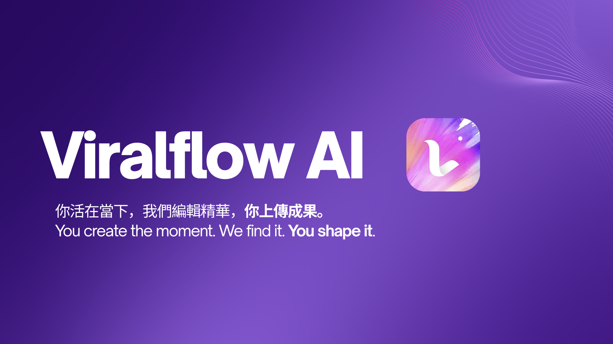
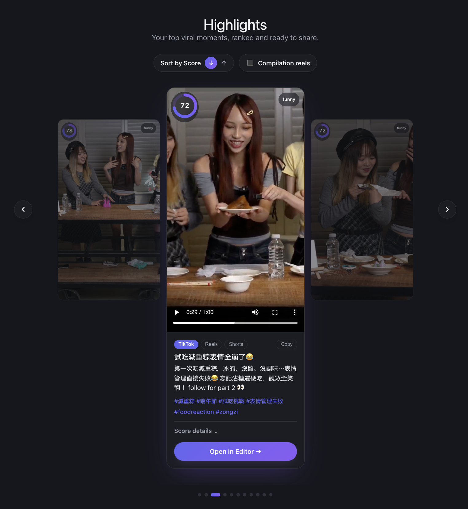
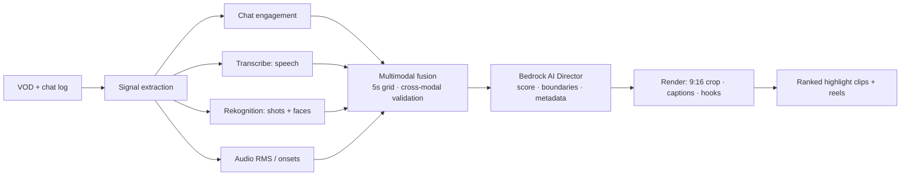

<div align="center">

# 🎬 Viralflow AI

**Turn hours of livestream VODs into ranked, captioned, publish-ready vertical highlight clips — in minutes, for dollars.**

🏆 **Amazon Web Services (AWS) Hackathon Winner** &nbsp;·&nbsp; Built with AWS Transcribe · Rekognition · Bedrock

[Live Demo](#-demo) · [Features](#-features) · [How it works](#-how-it-works) · [Architecture](#-architecture) · [Setup](#-getting-started)

</div>

---

## Overview

Streamers produce hours of live content, but audiences grow on short-form platforms (TikTok / IG Reels / YouTube Shorts). Manually reviewing a 2-hour VOD to cut five vertical clips takes an editor half a day.

**Viralflow AI ingests a livestream VOD plus its platform event log (chat) and automatically produces ranked, captioned, 9:16 highlight clips with platform-ready titles and hashtags — in minutes.**

The core idea: a highlight is a **cross-modal agreement event** — the chat erupts, the audio peaks, and the scene reacts *at the same moment*. We fuse engagement, audio/speech, and visual signals into one excitement curve, then a **Bedrock "AI Director"** turns statistical peaks into narrative clips (setup → payoff) with publish-ready metadata in 中文 + English.

---

## 🎥 Demo

> **TODO (media):** drop your assets into [`docs/media/`](docs/media/) and update the links below.

**▶ Live demo:** `<add your deployed URL here>`

**Walkthrough video:** `<add YouTube/Loom link here>`

<!-- Example once media is added:
[](https://youtu.be/your-video-id)
-->

| Upload & processing | Highlights gallery | Per-platform metadata |
|---|---|---|
| `docs/media/screenshot-upload.png` | `docs/media/screenshot-gallery.png` | `docs/media/screenshot-metadata.png` |

<!-- Replace the table cells above with real images, e.g.  -->

---

## ✨ Features

- **Multimodal highlight detection** — chat engagement, audio loudness/onset, speech (Transcribe), and visual signals (Rekognition) fused on a common 5-second grid, with **cross-modal validation** (a candidate survives only if ≥2 modalities spike together).
- **Bedrock "AI Director"** — judges each candidate with transcript + chat + keyframes, extends boundaries to capture the narrative arc, and assigns a virality score + mood label.
- **Face-guided 9:16 smart crop** — 16:9 → vertical, crop window panned to the median face position from Rekognition face tracking.
- **Burned-in captions** — zh/en karaoke captions from Transcribe word timestamps (ASS subtitle pipeline), plus a ≤12-char hook overlay on the opening seconds.
- **Per-platform metadata** — title, hook, caption, and hashtags rewritten per platform (TikTok / Reels / Shorts), one-click copy.
- **Compilation reels** — auto-edit multiple clips into a single multi-clip reel EDL.
- **In-browser editor** — open any clip's timeline in a vendored [OpenCut](https://github.com/OpenCut-app/OpenCut) editor for manual refinement.
- **Bilingual UI** — Traditional Chinese / English toggle across the app.
- **Ranked output** — clips sorted by virality score so creators publish the best first.

---

## 🔍 How it works

Three modules turn a raw VOD + chat log into publish-ready clips:

**1 · Intelligent content analysis (multimodal fusion)**
- **Engagement signal (unique data advantage):** parse the platform event log — chat rate z-score, unique chatters, join surges, laughter/slang bursts (哈哈哈, 笑死, 666), **VIP-weighted message value** (a whale reacting ≠ a lurker spamming), and **template-spam suppression** (novelty weighting kills copy-paste fan promos).
- **Audio + speech:** Amazon Transcribe (zh-TW, word-level timestamps, speaker labels) for *what* was said; ffmpeg RMS loudness + onset detection for *how loudly* (screams, crowd pops, song climaxes).
- **Visual:** Rekognition Video shot-segment detection (clean cut points) + face detection with emotions (SURPRISED/HAPPY spikes; boxes reused for smart cropping).
- **Fusion:** all signals z-normalized on a 5s grid, combined with per-vertical weights (talk-show vs gaming presets); cross-modal validation + the Bedrock AI Director confirm clip-worthiness.

**2 · AI automatic editing engine**
- Boundaries chosen for setup → payoff, snapped near Rekognition shot cuts.
- Face-guided 16:9 → 9:16 crop; burned-in zh captions from Transcribe timestamps; hook overlay on the first ~2.5s.

**3 · Multi-style production (platform adaptation)**
- Per-clip Bedrock metadata pack (title, hook, caption, hashtags) in Traditional Chinese + English; platform presets for length, caption style, and hook placement.

---

## 🏗 Architecture

**The demo runs local-first:** a Node server (`frontend/local-server/`) orchestrates the real Python pipeline (`python -m pipeline.run`) against AWS AI services, or serves pre-rendered results for a zero-latency demo. A **dormant AWS CDK stack** (`backend/`) is included as the cloud-scale design — the "scales to cloud" story — and is not required to run the project.



<details>
<summary><b>Cloud-scale design (dormant AWS CDK stack)</b></summary>

| Service | Role |
|---|---|
| **S3** | VOD + event-log landing zone; clip + manifest delivery |
| **EventBridge** | upload event triggers the pipeline |
| **Step Functions** | orchestrates parallel signal extraction |
| **Lambda** | chat parsing, signal fusion, job glue (ffmpeg container image) |
| **Amazon Transcribe** | zh-TW speech-to-text, word timestamps, speaker labels |
| **Amazon Rekognition Video** | shot segments, face detection + emotions |
| **Amazon Bedrock (Claude)** | mood classification, AI Director judging + metadata |
| **MediaConvert** | clip cutting, 9:16 transforms, delivery renditions |
| **DynamoDB** | job state + clip manifests |
| **CloudFront + S3** | gallery frontend + clip delivery |

Every stage is a stateless job on managed services — N VODs fan out to N parallel state-machine executions.

</details>

---

## 📊 Performance

Measured on a real 74-minute idol-show VOD:

- **Speed:** full-VOD visual analysis ≈ 29 min; **fast mode ≈ 7.5 min** — candidates detected from chat+audio+speech first, Rekognition face jobs run only on candidate windows, overlapped with the Bedrock Director.
- **Cost:** ≈ **$5 per VOD** in fast mode (Transcribe ≈ $1.8, Rekognition ≈ $1, Bedrock ≈ $0.3, render ≈ $1) vs. hours of editor time.
- **Precision:** cross-modal validation eliminated 100% of chat-template-spam false positives on the demo VOD.

---

## 🧰 Tech stack

| Layer | Tech |
|---|---|
| **Frontend** | React 19, TypeScript, Vite, React Router, i18n (zh-TW / en) |
| **Local backend** | Node.js server (`frontend/local-server/`) — runs the pipeline as a subprocess, streams progress over WebSocket, serves media |
| **Pipeline** | Python 3.12 · boto3 · numpy · scipy · pandas · ffmpeg (with libass) |
| **Cloud AI** | AWS Transcribe · Rekognition · Bedrock · S3 |
| **Editor** | Vendored [OpenCut](https://github.com/OpenCut-app/OpenCut) (Next.js) |
| **Deploy** | Docker · Fly.io (single-container cached demo) |
| **Cloud design** | AWS CDK (Step Functions / Lambda / MediaConvert — dormant) |

---

## 🚀 Getting started

### Prerequisites
- **Python 3.12** with a repo `.venv` and `pipeline/requirements.txt` installed
- **ffmpeg with libass + freetype** (use the `homebrew-ffmpeg/ffmpeg` tap, not slim homebrew-core)
- **AWS credentials** with access to Transcribe, Rekognition, Bedrock, and S3

### Run locally
```bash
# 1. Python pipeline deps
python3 -m venv .venv && source .venv/bin/activate
pip install -r pipeline/requirements.txt

# 2. Frontend env
cd frontend
cp .env.example .env   # only needed for the cloud build; the demo uses .env.demo
npm install

# 3. Start the app (local server + Vite dev server)
npm run dev            # http://localhost:5173
# npm run dev:all      # also launches the OpenCut editor
```

Run the pipeline directly:
```bash
python3 -m pipeline.run --stream-id <id>
```

### Deploy (single-container cached demo)
A `Dockerfile` + `fly.toml` package the app as a one-container cached demo (no Python/ffmpeg/AWS needed at runtime — it replays a pre-rendered run). See [`docs/`](docs/) for details. Deploy with `fly deploy`; run a **single machine** (job state is in-process).

---

## 📁 Repository structure

```
frontend/            React SPA + local-server/ (the real local-first backend)
pipeline/            Python highlight pipeline (signals, fusion, director, render)
apps/editor/         Vendored OpenCut editor (Next.js) for manual refinement
backend/             Dormant AWS CDK stack — the cloud-scale design
.kiro/               Design specs & steering docs
docs/                Additional documentation + media
```

---

## 🗺 Future work

- Live ingest (IVS / MediaLive HLS) for near-real-time clipping over rolling windows
- Additional platform presets and languages
- Hosted editor + one-click publish per platform
- Creator-tunable weight presets per content vertical

---

## 👥 Team

**The Waymakers** — Jason Nishio · Nelson Nishio · Aaron Lin

## 🏆 Awards

🏆 **Hackathon Winner**  
🥉 3rd Prize - $10,000 NTD - AWS Summit Taipei AI Everywhere Hackathon 

## 📄 License

*(Add a license, e.g. MIT — see [choosealicense.com](https://choosealicense.com/).)*
