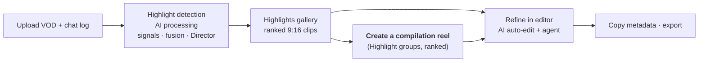
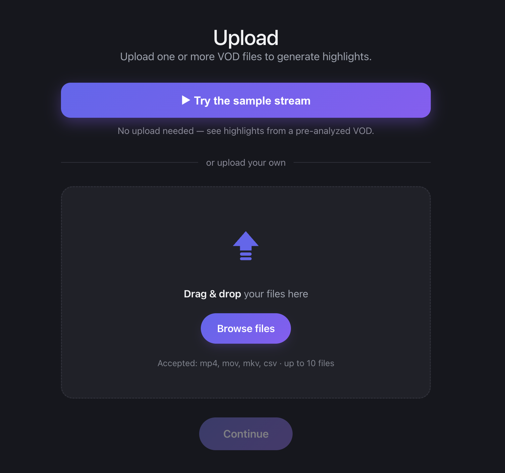
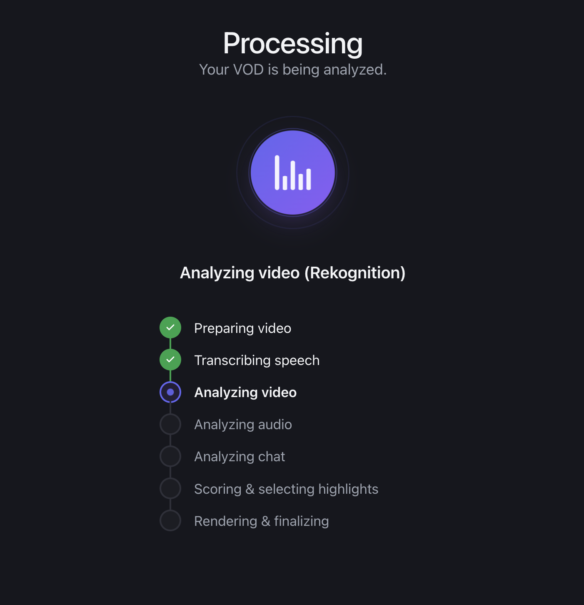
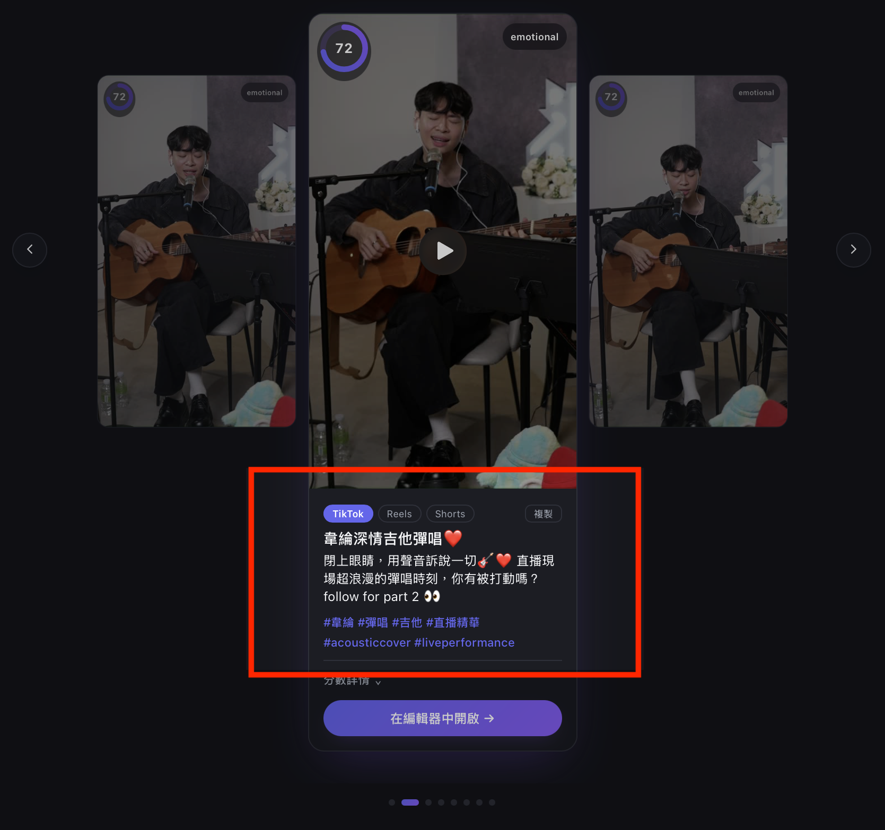
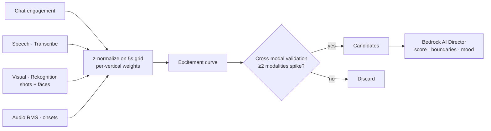
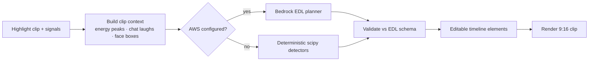
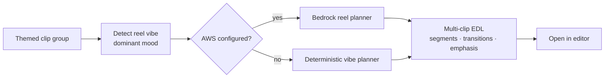
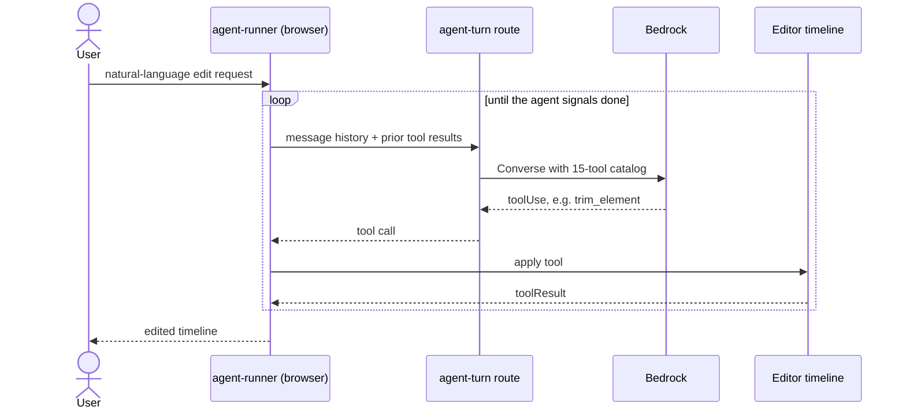
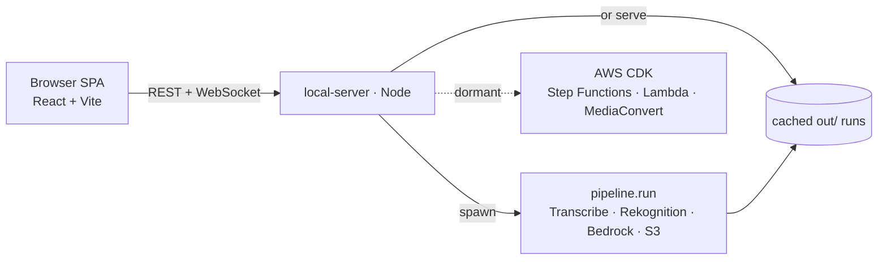
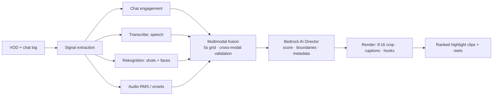

<div align="center">

# 🎬 Viralflow AI

**Turn hours of livestream VODs into ranked, captioned, publish-ready vertical highlight clips — in minutes, not hours.**

🏆 **3rd Place (NT$ 10,000) Winner @ Amazon Web Services (AWS) Summit Taipei Hackathon 2026**

Built with AWS Transcribe · Rekognition · Bedrock

[Live Demo](#-demo) · [Features](#-features) · [How it works](#-how-it-works) · [Architecture](#-architecture) · [Setup](#-getting-started)

<!-- 🖼️ VISUAL PLACEHOLDER — hero banner / logo lockup. Add as docs/media/hero-banner.png -->

</div>

---

## Overview

Streamers produce hours of live content, but audiences grow on short-form platforms (TikTok / Instagram Reels / YouTube Shorts). Manually reviewing a 2-hour VOD to cut several vertical clips + editing them for engagement takes creators half a day.

**Viralflow AI ingests a livestream VOD along with its platform event log (chat) and automatically produces ranked, captioned, 9:16 highlight clips with platform-ready titles and hashtags — in minutes. The best part is: the creator is in control. Viralflow includes a built-in intuitive video editor that allows creators to review AI's automatic edits, and add their own personal touch to it.**

The core idea: a highlight is a **cross-modal agreement event** — the chat erupts, the audio peaks, and the scene reacts *at the same moment*. We fuse engagement, audio/speech, and visual signals into one excitement curve, then a **Bedrock "AI Director"** turns statistical peaks into narrative clips (setup → payoff) with publish-ready metadata in 中文 + English.

**The journey, end to end:**



---

## 🎥 Demo

> **TODO (media):** drop your assets into [`docs/media/`](docs/media/) and update the links below.

**▶ Walkthrough video:** *(talked over the silent video during presentation/pitch)*

https://youtu.be/0ntHNhyz9Xo


**Demonstrates**:
1. AI highlight detection with real-time process updates through 3 data modalities (live stream chat analysis, audio analysis, and video analysis)
2. Highlight carousel for selecting detected highlights
3. Built-in video editor, including AI auto-editing, auto-captioning, and seamless exporting

<!-- PLACEHOLDER — hero demo GIF (30–60s loop of the full flow). Add as docs/media/demo.gif,
     then swap the line below for:  
<!-- > **Demo GIF placeholder** — add `docs/media/demo.gif` (full upload → highlights → edit loop). -->

<!-- 
| **Per-platform metadata** | **Agentic editor** | **Compilation reels** |
| 📸 `docs/media/screenshot-metadata.png` | 📸 `docs/media/screenshot-editor.png` | 📸 `docs/media/screenshot-compilation.png` | -->

--- 
## Screenshots

<table align="center">
    <tr></tr>
    <tr>
        <td align="center"><b>Upload VODs Screen</b></td>
        <td align="center"><b>Transparent AI Processing Screen</b></td>
    </tr>
    <tr>
        <td></td>
        <td></td>    
    </tr>
    <tr> 
        <td align="center"><b>Highlights Gallery<b></td>
        <td align="center"><b>Per-platform Metadata<b></td>
    </tr>
    <tr>
        <td></td>
        <td></td>
    </tr>
</table>


---

## ✨ Features

- **Multimodal highlight detection** — chat engagement, audio loudness/onset, speech (Transcribe), and visual signals (Rekognition) fused on a common 5-second grid, with **cross-modal validation** (a candidate survives only if ≥2 modalities spike together).
- **Bedrock "AI Director"** — judges each candidate with transcript + chat + keyframes, extends boundaries to capture the narrative arc, and assigns a virality score + mood label.
- **Face-guided 9:16 smart crop** — 16:9 → vertical, crop window panned to the median face position from Rekognition face tracking.
- **Burned-in captions** — zh/en karaoke captions from Transcribe word timestamps (ASS subtitle pipeline), plus a ≤12-char hook overlay on the opening seconds.
- **Per-platform metadata** — title, hook, caption, and hashtags rewritten per platform (TikTok / Reels / Shorts), one-click copy.
- **AI auto-edit engine** — a per-clip editing pass that auto-zooms on the reacting speaker during laughter/loud moments, flashes split-second onomatopoeia captions ("WHAT?!", "NO WAY") on vocal accents, and drops mood-matched SFX. A Bedrock (Claude) brain plans the edit; a deterministic scipy detector is the offline fallback. Every edit lands as an *editable* timeline element, not a baked-in overlay. ([details](#-ai-editing-auto-edit-reels--agentic-editor))
- **Compilation reels** — auto-edit a themed group of clips into one multi-clip reel with transitions and per-clip emphasis matched to the reel's *vibe* (punchy whip-pans for "hype", gentle crossfades for "emotional").
- **Agentic in-browser editor** — a vendored [OpenCut](https://github.com/OpenCut-app/OpenCut) fork (Next.js + Rust/WASM GPU renderer) with an **autonomous editing agent**: describe a change in natural language and a Bedrock tool-calling loop trims, retimes, splits, adds captions/effects, and more across the timeline — plus one-click AI auto-edit and auto-caption.
- **Bilingual UI** — Traditional Chinese / English toggle across the app.
- **Ranked output** — clips sorted by virality score so creators publish the best first.

---

## 🔍 How it works

Three modules turn a raw VOD + chat log into publish-ready clips:

**1 · Intelligent content analysis (multimodal fusion)**
- **Engagement signal (unique data advantage):** parse the platform event log — chat rate z-score, unique chatters, join surges, laughter/slang bursts (哈哈哈, 笑死, 666), **VIP-weighted message value** (a whale reacting ≠ a lurker spamming), and **template-spam suppression** (novelty weighting kills copy-paste fan promos).
- **Audio + speech:** Amazon Transcribe (zh-TW, word-level timestamps, speaker labels) for *what* was said; ffmpeg RMS loudness + onset detection for *how loudly* (screams, crowd pops, song climaxes).
- **Visual:** Rekognition Video shot-segment detection (clean cut points) + face detection with emotions (SURPRISED/HAPPY spikes; boxes reused for smart cropping).
- **Fusion:** all signals z-normalized on a 5s grid, combined with per-vertical weights (talk-show vs gaming presets); cross-modal validation + the Bedrock AI Director confirm clip-worthiness.

**Multimodal fusion — how four signals become one excitement curve:**



<!-- PLACEHOLDER — the signature excitement-curve chart with detected highlight windows shaded. Add as docs/media/excitement-curve.png -->
> 📸 **Screenshot placeholder** — excitement curve with detected highlight windows · add `docs/media/excitement-curve.png`.

**2 · AI automatic editing engine**
- Boundaries chosen for setup → payoff, snapped near Rekognition shot cuts.
- Face-guided 16:9 → 9:16 crop; burned-in zh captions from Transcribe timestamps; hook overlay on the first ~2.5s.
- A further **AI auto-edit pass** layers reaction zooms, onomatopoeia captions, and mood-matched SFX — see [AI editing](#-ai-editing-auto-edit-reels--agentic-editor) below.

**3 · Multi-style production (platform adaptation)**
- Per-clip Bedrock metadata pack (title, hook, caption, hashtags) in Traditional Chinese + English; platform presets for length, caption style, and hook placement.

> 📖 **Algorithm deep dive:** [`docs/algorithm-decisions.md`](docs/algorithm-decisions.md) — fast vs. full visual mode, fusion-weight choices, cross-modal validation, and every algorithmic tradeoff (with the ideas deliberately set aside and why).

---

## 🎬 AI editing (auto-edit, reels & agentic editor)

Detection and cropping produce a clean clip. Then a second AI layer makes it *feel* edited. All three subsystems below emit the **same EDL contract** ([`docs/contracts/edl.schema.json`](docs/contracts/)) that the in-browser editor renders, so nothing is ever baked in irreversibly.

### 1 · AI auto-edit engine (`pipeline/autoedit.py`, `pipeline/autoedit_llm.py`)
After a highlight is cut, an editing pass adds "make it more viral" beats:
- **Reaction zoom** — punches in on the reacting speaker (Rekognition face box) during laughter or a loud-audio spike.
- **Onomatopoeia flash captions** — split-second "WHAT?!" / "NO WAY" overlays on vocal accents/emphasis.
- **Mood-matched SFX** — e.g. crickets after an awkward silence — chosen from the clip's vibe.

**Two-tier brain (mirrors the AI Director):** a Bedrock (Claude) call reasons over the clip's multimodal context (audio-energy peaks, chat laughter, face boxes) and emits a **sequenced, timestamped EDL**; a deterministic scipy detector (`find_peaks`) is the offline fallback, so the loop stays runnable without AWS. Every emitted edit is materialized as an **ordinary, editable timeline element** — adjustable, deletable, or extendable by the user afterward.

**Auto-edit engine — two-tier brain with an offline fallback:**



### 2 · Compilation reels (`pipeline/compile_edl.py`, `pipeline/compilations.py`)
Turn a themed group of highlights into **one multi-clip reel** on a single timeline: a segment per clip laid end to end, transitions between them, and light per-clip emphasis (opening hook + reaction zooms) chosen to match the reel's dominant **vibe** — a "hype" reel gets punchy whip-pan cuts and reaction zooms; an "emotional" one gets gentle crossfades and fades. Same two-tier planner (Bedrock brain + deterministic vibe planner fallback) and same EDL contract as the single-clip engine.

**Compilation reel — one timeline, vibe-matched:**



<!-- 📸 VISUAL PLACEHOLDER — compilation mode in the highlights gallery (reel sections + curation). Add as docs/media/screenshot-compilation.png -->
> 📸 **Screenshot placeholder** — compilation mode (reel sections + add/remove curation) · add `docs/media/screenshot-compilation.png`.

### 3 · Agentic in-browser editor (`apps/editor/`)
A vendored fork of [OpenCut](https://github.com/OpenCut-app/OpenCut) (Next.js + a Rust/WASM GPU effects renderer), wired to this project's clips + auto-edit EDLs via a thin "highlight-api" backend. Beyond one-click **AI auto-edit** and **auto-caption**, it runs an **autonomous editing agent**: you describe a change in natural language and a Bedrock **tool-calling loop** executes it against the real timeline, with 15 editing tools —
`trim_element`, `retime_element`, `split_element`, `move_element`, `delete_elements`, `duplicate_elements`, `add_track`, `insert_text_element`, `add_blur_effect`, `remove_clip_effect`, `toggle_clip_effect`, `toggle_track_mute`, `toggle_track_visibility`, `toggle_elements_muted`, `toggle_elements_visibility`.

**Agentic editor — the tool-calling loop:**



<!-- 🎞️ VISUAL PLACEHOLDER — GIF of the agent editing the timeline from a natural-language prompt. Add as docs/media/agent-edit.gif -->
> 🎞️ **GIF placeholder** — agent editing the timeline from a prompt · add `docs/media/agent-edit.gif`.

---

## 🏗 Architecture

**The demo runs local-first:** a Node server (`frontend/local-server/`) orchestrates the real Python pipeline (`python -m pipeline.run`) against AWS AI services, or serves pre-rendered results for a zero-latency demo. A **dormant AWS CDK stack** (`backend/`) is included as the cloud-scale design — the "scales to cloud" story — and is not required to run the project.

**Runtime topology (local-first):**



*The data-flow / signal pipeline itself:*




<details>
<summary><b>Cloud-scale design (dormant AWS CDK stack)</b></summary>

| Service | Role |
|---|---|
| **S3** | VOD + event-log landing zone; clip + manifest delivery |
| **EventBridge** | upload event triggers the pipeline |
| **Step Functions** | orchestrates parallel signal extraction |
| **Lambda** | chat parsing, signal fusion, job glue (ffmpeg container image) |
| **Amazon Transcribe** | zh-TW speech-to-text, word timestamps, speaker labels |
| **Amazon Rekognition Video** | shot segments, face detection + emotions |
| **Amazon Bedrock (Claude)** | mood classification, AI Director judging + metadata |
| **MediaConvert** | clip cutting, 9:16 transforms, delivery renditions |
| **DynamoDB** | job state + clip manifests |
| **CloudFront + S3** | gallery frontend + clip delivery |

Every stage is a stateless job on managed services — N VODs fan out to N parallel state-machine executions.

</details>

---

## 📊 Performance

Measured on a real 74-minute idol-show VOD:

- **Speed:** full-VOD visual analysis ≈ 29 min; **fast mode ≈ 7.5 min** — candidates detected from chat+audio+speech first, Rekognition face jobs run only on candidate windows, overlapped with the Bedrock Director.
- **Cost:** ≈ **$5 per VOD** in fast mode (Transcribe ≈ $1.8, Rekognition ≈ $1, Bedrock ≈ $0.3, render ≈ $1) vs. hours of editor time.
- **Precision:** cross-modal validation eliminated 100% of chat-template-spam false positives on the demo VOD.

---

## 🧰 Tech stack

| Layer | Tech |
|---|---|
| **Frontend** | React 19, TypeScript, Vite, React Router, i18n (zh-TW / en) |
| **Local backend** | Node.js server (`frontend/local-server/`) — runs the pipeline as a subprocess, streams progress over WebSocket, serves media |
| **Pipeline** | Python 3.12 · boto3 · numpy · scipy · pandas · ffmpeg (with libass) |
| **Cloud AI** | AWS Transcribe · Rekognition · Bedrock · S3 |
| **Editor** | Vendored [OpenCut](https://github.com/OpenCut-app/OpenCut) fork (Next.js + Rust/WASM GPU renderer) with an AI editing agent (Bedrock tool-calling) |
| **AI auto-edit** | Bedrock (Claude) EDL planner + deterministic scipy fallback (`pipeline/autoedit*.py`, `pipeline/compile_edl.py`) |
| **Deploy** | Docker · Fly.io (single-container cached demo) |
| **Cloud design** | AWS CDK (Step Functions / Lambda / MediaConvert — dormant) |

---

## 🚀 Getting started

### Prerequisites
- **Python 3.12** with a repo `.venv` and `pipeline/requirements.txt` installed
- **ffmpeg with libass + freetype** (use the `homebrew-ffmpeg/ffmpeg` tap, not slim homebrew-core)
- **AWS credentials** with access to Transcribe, Rekognition, Bedrock, and S3

### Run locally
```bash
# 1. Python pipeline deps
python3 -m venv .venv && source .venv/bin/activate
pip install -r pipeline/requirements.txt

# 2. Frontend env
cd frontend
cp .env.example .env   # only needed for the cloud build; the demo uses .env.demo
npm install

# 3. Start the app (local server + Vite dev server)
npm run dev            # http://localhost:5173
# npm run dev:all      # also launches the OpenCut editor
```

Run the pipeline directly:
```bash
python3 -m pipeline.run --stream-id <id>
```

### Deploy (single-container cached demo)
A `Dockerfile` + `fly.toml` package the app as a one-container cached demo (no Python/ffmpeg/AWS needed at runtime — it replays a pre-rendered run). See [`docs/`](docs/) for details. Deploy with `fly deploy`; run a **single machine** (job state is in-process).

---

## 📁 Repository structure

```
frontend/            React SPA + local-server/ (the real local-first backend)
pipeline/            Python highlight pipeline (signals, fusion, director, render)
apps/editor/         Vendored OpenCut editor (Next.js) for manual refinement
backend/             Dormant AWS CDK stack — the cloud-scale design
.kiro/               Design specs & steering docs
docs/                Additional documentation + media
```

---

## 🗺 Future work

- Live ingest (IVS / MediaLive HLS) for near-real-time clipping over rolling windows
- Additional platform presets and languages
- Hosted editor + one-click publish per platform
- Creator-tunable weight presets per content vertical

---

## 👥 Team

**The Waymakers** — Jason Nishio · Nelson Nishio · Aaron Lin

## 🏆 Awards

🏆 **Hackathon Winner**  
🥉 3rd Prize - $10,000 NTD - AWS Summit Taipei AI Everywhere Hackathon 
