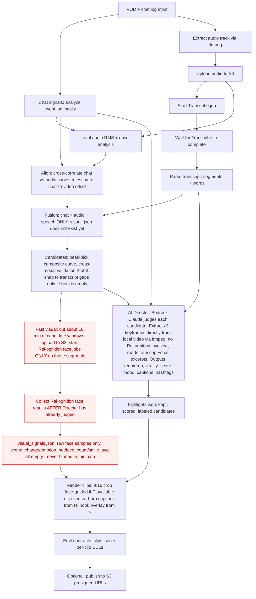
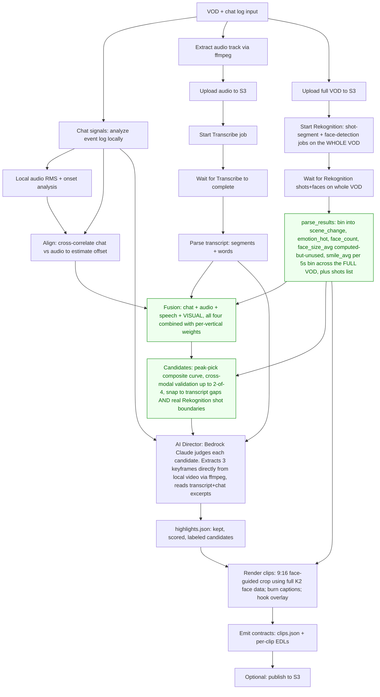

# Highlight Detection Algorithm — Design History & Decisions

Single source of truth for explaining *why* the algorithm looks the way it
does: the original "do everything" design, the deliberate cuts made to hit
the hackathon timeline, and every improvement considered but not implemented
(with the specific reason each was set aside). See
`.kiro/steering/architecture.md` for the current system architecture this
sits underneath.

## a) Initial "full" approach

The original design ran every signal at full strength on the whole VOD before
fusing:

- **Chat**: parse the full platform event log, compute VIP/level-weighted
  message value with template-spam suppression (novelty weighting), laughter/
  emoji regex matching, join-surge detection — all per 5-second bin across the
  entire session. (This part shipped as designed; see `signals/chat.py`.)
- **Audio**: RMS loudness + onset-jump detection across the full extracted
  audio track. (Also shipped as designed; see `signals/audio.py`.)
- **Speech**: Amazon Transcribe on the full VOD's audio, word-level timestamps
  and speaker labels, feeding a word-rate feature into fusion.
- **Visual**: Amazon Rekognition Video running **shot-segment detection and
  face detection on the entire VOD**, not just candidate windows — the
  original plan billed and analyzed 100% of the footage, giving `scene_change`
  and `emotion_hot` (and later `face_count`/`face_size_avg`/`smile_avg`)
  binned series across the whole timeline, on equal footing with chat/audio
  for peak-picking.
- **Fusion**: all four modalities (chat, audio, speech, visual) combined with
  per-vertical weights, cross-modal validation requiring ≥2 modalities to
  agree, peak-picking on the composite curve.
- **AI Director**: Bedrock (Claude) judges every surviving candidate with
  transcript excerpt, chat excerpt, and keyframes — sets narrative boundaries,
  virality score, mood, platform metadata.
- **Render**: face-guided 9:16 crop, burned-in captions, hook overlay.

This is the version implicitly described in the top-level `README.md`'s
architecture table and diagram — visual sits alongside chat/audio/speech as an
equal, whole-VOD contributor to fusion.

## b) Optimizations made & intended tradeoffs

### Fast visual mode (`--visual-mode fast`, the default)

**What changed:** Rekognition face detection no longer runs on the whole VOD.
Instead, fusion runs first on chat + audio + speech only, producing candidate
windows. *Then* the VOD is cut into short segments around those candidate
windows only (`start_face_jobs_for_windows()`, `pad_s=10.0` padding), each
segment is uploaded and face-detected independently, and the results are
merged back into VOD-global timestamps (`collect_face_jobs()`).

**Intended tradeoff:** Rekognition is priced and billed by minutes of video
analyzed. Analyzing ~10 minutes of candidate footage instead of a 60-120
minute VOD cuts Rekognition wall-clock and cost by roughly the same factor —
measured at ≈$1 (fast mode, faces-on-candidates) vs ≈$17 (full-VOD visual
mode) per 74-minute VOD, and ≈7.5 min vs ≈29 min pipeline latency. This is a
deliberate, working-as-intended design decision, not an oversight — chat and
audio are treated as sufficient "first pass" filters for *where* to look,
under the operating assumption that a genuinely funny or exciting moment
reliably shows up in chat reaction or audio loudness even before visual
analysis runs.

**What this costs, explicitly:** in fast mode, visual data has **zero
influence over which windows become candidates** in the first place — it can
only refine crop position (`face_crop_x()`) and inform the Director's
per-candidate keyframe judgment *after* a candidate already exists from
chat/audio/speech alone. A moment with a strong visual signal but muted chat
and unremarkable audio (e.g., a subtle facial reaction, a silent visual gag)
cannot be discovered by the algorithm in fast mode. This is a known and
accepted recall gap, not a bug — see item (c)#1 below for the discussion of
whether it's worth closing.

**Also note:** because fast-mode's visual data arrives *after* fusion has
already run, `fusion.py`'s shot-boundary snapping (`snap_to_boundaries()`)
and any visual scoring features are effectively inert in the default run —
`visual_signals.json` in fast mode is a stub (`shots: []`, empty binned
series) that only carries sparse face samples for crop positioning. These
features activate correctly if someone runs `--visual-mode full`, but full
mode is not the default specifically because of the cost/latency tradeoff
above.

### Everything else in the current pipeline shipped without a scope cut

Chat's novelty-weighting/spam-suppression, audio's RMS+onset approach,
Transcribe word-level timestamps, the Director's multimodal keyframe judging,
face-guided smart crop, and the EDL/render pipeline were all built to the
originally intended design — the only deliberate reduction from the "full"
approach was the visual modality's fast-mode candidate-window restriction
described above.

## c) Potential add-ons discussed — and why each was set aside

Five items were raised during algorithm review as candidate improvements.
None were implemented for the hackathon build. Reasoning for each is recorded
here so the decision (and its rationale) isn't lost.

### 1. Whole-VOD cheap visual recall signal (non-Rekognition)

**Proposal:** add a cheap, local (non-billed) motion/scene-cut signal — e.g.
ffmpeg frame-differencing or scene-cut detection sampled across the entire
VOD — as a genuine fourth candidate-selection input, without touching the
existing Rekognition-on-candidates cost model. This would only help *before*
peak-picking (recall), not after (the Director already sees visual context
via keyframes).

**Why set aside:** judged not worth the effort. Chat is already a strong,
validated proxy for "did something happen worth reacting to" — if a moment is
genuinely funny or exciting, chat reaction or audio loudness is expected to
surface it. The specific gap this would close (visual-only moments with muted
chat/audio) was judged to be a narrow edge case relative to the effort of
adding and validating a new modality. **Decision: hold, not pursued.**

### 2. Self-calibrating fusion weights from Director verdicts

**Problem:** `fusion.py`'s `WEIGHTS` dict (per-vertical modality weights) and
its thresholds (`find_peaks(height=0.8, ...)`, `modality_bar=0.75`,
`edge_threshold=0.3`) are all hand-picked constants. Nothing in the pipeline
checks whether they're actually good — there's no feedback loop and no eval
set. There is presently no way to measure whether any change to
weights/signals/thresholds actually helps.

**Existing free signal:** `director.py` already produces labeled ground truth
on every run — a `keep`/`drop` verdict plus a 0-100 `virality_score` per
candidate, judged by an LLM that saw the transcript, chat, and keyframes. None
of this is currently persisted beyond the final `highlights.json`; it's
thrown away after each run.

**Proposed fix (later):**
1. Log, per candidate, the per-modality z-scores at its peak (`factors{}` from
   `candidates_from_curve`) alongside the Director's eventual verdict
   (keep/drop + virality_score). Accumulate this across every VOD processed.
2. Periodically (not live/online — just occasionally, offline) refit the
   fusion weights against that accumulated data. Doesn't need to be fancy —
   even a simple logistic regression of "which modality z-scores predict a
   keep verdict / high virality_score" would beat static hand-picked
   constants.
3. This also naturally produces the eval set that's currently missing.

**Why it's high leverage:** it's the only mechanism in the pipeline that
could improve itself over time instead of staying frozen at whatever was
guessed once. Cost is near zero since the labels already exist — they just
aren't being kept.

**Why set aside:** the goal for the current milestone is a working
demonstration for hackathon judges, not a production system with a validated
feedback loop — there's no time to accumulate multiple runs' worth of
verdicts, build the calibration tooling, and confirm a refit actually
improves results before judging. **Decision: deferred — judged genuinely
high-leverage and worth revisiting once there's room to iterate post-MVP.**

### 3. Audio-event classification (laughter/applause/cheering vs. loud-in-general)

**Proposal:** add a pretrained audio-event classifier (e.g. YAMNet via
TensorFlow Hub, trained on AudioSet — has `Laughter`, `Applause`, `Cheering`,
`Crowd` classes among 521) so the audio modality can distinguish "loud
because of a genuine human reaction" from "loud because of a bass drop, mic
bump, or game sound effect." Would run once per extracted audio track,
locally, no new AWS service. (PANNs/CNN14 was also considered — similar
coverage, slightly heavier install, no clear quality win over YAMNet for this
use case.)

**Why set aside:** this is not currently a dependency in the project, and
integrating an unvalidated new ML model into pipeline code shortly before a
hackathon demo carries real risk of breaking something that currently works,
with no time budget to test it properly. Judged: technically the
lowest-friction of the "add a new model" options considered (single `pip
install`, no training, no GPU requirement, well-established model), but still
not worth the risk given the "show something that works" goal. **Decision:
deferred — worth revisiting post-MVP with time to validate.**

### 4. Lexical excitement markers on speech (transcript), analogous to chat's laugh-regex

**Proposal:** replace/augment `speech_features()`'s word-rate-only feature
with a regex-based excitement/laughter marker search over transcript
segments, mirroring the approach already validated in `signals/chat.py`'s
`LAUGH_RE`.

**Why set aside, on reflection:** two independent lines of reasoning
converged against this. First, raw word-rate (the current implementation) is
a weak proxy — fast, energetic speech looks identical to fast, mundane
speech (e.g. reading donations aloud), and it cannot capture the *dip* in
speech rate that often precedes a punchline (a dramatic pause), which
peak-picking would actively ignore rather than reward. Second, and more
fundamentally: if a moment is genuinely funny, chat is expected to react
(chat's laugh-regex + novelty weighting is the stronger, already-validated
signal for this); if a moment is loud/intense, audio's RMS+onset already
catches it. A streamer's own lexical excitement markers in their speech don't
clearly fill a gap that chat and audio leave open — it would mostly
re-derive a weaker copy of what chat already does, on a channel (the
streamer's own words) that's less reliable for detecting *audience* reaction
than chat is. **Decision: hold, not pursued.** (The narrower cases where
speech content alone might matter — a quiet, emotionally significant line
with no chat eruption and no loudness spike — would need semantic/sentiment
analysis of the transcript, not lexical markers, and were judged out of
scope for this round.)

### 5. Smaller polish items (shape detection, validation window widening, face_size_avg/smile_avg fixes)

**Proposal:** a bundle of smaller fixes — detecting "dip then rise" shape in
chat/speech curves for comedic timing; widening cross-modal validation's
agreement window to account for Gaussian-smoothing peak-shift; wiring the
already-computed but currently-unused `face_size_avg` into scoring; fixing
`smile_avg`'s denominator (currently averages confidence only over already-
smiling faces, not all visible faces, so it doesn't scale with reaction
size).

**Why set aside:** explicitly sequenced behind items #1–#4. Several of these
(face_size_avg, smile_avg, shot-boundary snapping) are polishing a visual
scoring path that — per section (b) above — doesn't run in the default fast
mode. There was also no eval methodology available to check whether these
specific fixes would actually improve results (see item #2). **Decision:
hold until the higher-priority items above are resolved or the project has
an eval set to validate against.**

## Summary table

| # | Proposal | Status | Primary reason |
|---|----------|--------|-----------------|
| — | Fast visual mode (candidate-window-only Rekognition) | **Shipped** | Deliberate cost/latency optimization; ~17x cost reduction, ~4x latency reduction measured |
| 1 | Whole-VOD cheap visual recall signal | Not pursued | Chat/audio judged sufficient; narrow edge case for the effort |
| 2 | Self-calibrating fusion weights | Deferred (post-MVP) | No time to validate before hackathon; judged high leverage for later |
| 3 | Audio-event classifier (YAMNet) | Deferred (post-MVP) | New unvalidated dependency close to demo; real regression risk |
| 4 | Lexical excitement markers on speech | Not pursued | Weak proxy; likely redundant with chat's stronger, already-validated signal |
| 5 | Smaller polish items | Deferred, sequenced behind #1–#4 | Depends on resolving #1/#2; some target a path that doesn't run by default |

flowchart TD
    A[VOD + chat log input] --> B[Chat signals: analyze event log locally]
    A --> C[Extract audio track via ffmpeg]
    C --> D[Upload audio to S3]
    D --> E[Start Transcribe job]
    B --> F[Local audio RMS + onset analysis]
    D --> F
    E --> G[Wait for Transcribe to complete]
    G --> H[Parse transcript: segments + words]
    B --> I[Align: cross-correlate chat vs audio curves to estimate chat-to-video offset]
    F --> I
    I --> J[Fusion: chat + audio + speech ONLY visual_json does not exist yet]
    H --> J
    J --> K[Candidates: peak-pick composite curve, cross-modal validation 2-of-3, snap to transcript gaps only shots is empty]
    K --> L[Fast visual: cut ~10min of candidate windows, upload to S3, start Rekognition face jobs ONLY on those segments]
    K --> M[AI Director: Bedrock Claude judges each candidate. Extracts 3 keyframes directly from local video via ffmpeg no Rekognition involved, reads transcript+chat excerpts. Outputs keep/drop, virality_score, mood, captions, hashtags]
    H --> M
    B --> M
    M --> N[highlights.json: kept, scored, labeled candidates]
    L --> O[Collect Rekognition face results AFTER Director has already judged]
    O --> P[visual_signals.json: raw face samples only. scene_change/emotion_hot/face_count/smile_avg all empty - never binned in this path]
    N --> Q[Render clips: 9:16 crop face-guided if P available, else center; burn captions from H; hook overlay from N]
    P --> Q
    Q --> R[Emit contracts: clips.json + per-clip EDLs]
    R --> S[Optional: publish to S3 presigned URLs]

    classDef gap fill:#fee,stroke:#c00,color:#900
    class L,O,P gap

flowchart TD
    A[VOD + chat log input] --> B[Chat signals: analyze event log locally]
    A --> C[Extract audio track via ffmpeg]
    C --> D[Upload audio to S3]
    A --> C2[Upload full VOD to S3]
    D --> E[Start Transcribe job]
    C2 --> F2[Start Rekognition: shot-segment + face-detection jobs on the WHOLE VOD]
    B --> G[Local audio RMS + onset analysis]
    E --> H[Wait for Transcribe to complete]
    H --> I[Parse transcript: segments + words]
    F2 --> J2[Wait for Rekognition shots+faces on whole VOD]
    J2 --> K2[parse_results: bin into scene_change, emotion_hot, face_count, face_size_avg computed-but-unused, smile_avg per 5s bin across the FULL VOD + shots list]
    B --> L2[Align: cross-correlate chat vs audio to estimate offset]
    G --> L2
    L2 --> M2[Fusion: chat + audio + speech + VISUAL all four combined with per-vertical weights]
    I --> M2
    K2 --> M2
    M2 --> N2[Candidates: peak-pick composite curve, cross-modal validation up to 2-of-4, snap to transcript gaps AND real Rekognition shot boundaries]
    K2 --> N2
    N2 --> O2[AI Director: Bedrock Claude judges each candidate. Extracts 3 keyframes directly from local video via ffmpeg, reads transcript+chat excerpts]
    I --> O2
    B --> O2
    O2 --> P2[highlights.json: kept, scored, labeled candidates]
    P2 --> Q2[Render clips: 9:16 face-guided crop using full K2 face data; burn captions; hook overlay]
    K2 --> Q2
    Q2 --> R2[Emit contracts: clips.json + per-clip EDLs]
    R2 --> S2[Optional: publish to S3]

    classDef scored fill:#efe,stroke:#080,color:#060
    class K2,M2,N2 scored

## Appendix: full pipeline flowcharts by visual mode

Traced directly from `pipeline/run.py`'s actual execution order (not an
idealized version). Requires a Mermaid-capable Markdown preview to render
(see note below); otherwise the fenced blocks will show as plain code.

> **Note on rendering:** VS Code/Kiro's built-in Markdown preview does not
> render Mermaid by default. Install the "Markdown Preview Mermaid Support"
> extension (`bierner.markdown-mermaid`), or view this file on GitHub, which
> renders Mermaid natively.

### Fast mode (`--visual-mode fast`, the default)

Red boxes (`L`, `O`, `P`) are where Rekognition runs in fast mode. The arrow
from those boxes only flows into `Q` (render/crop) — never back into `J` or
`K` (fusion/scoring). Rekognition's face/emotion data exists in this run, but
it's produced after both candidate selection and the Director's verdict are
already final, so it can only affect *where the crop sits*, not *what got
picked or how it scored*.

### Full mode (`--visual-mode full`)

Green boxes (`K2`, `M2`, `N2`) show the difference from fast mode: Rekognition's
binned output feeds both the weighted excitement score (`M2`) and real
shot-boundary snapping (`N2`, since `shots` is populated here instead of
empty) — in addition to still feeding the render crop (`Q2`), same as fast
mode. This is the only path where "vision contributes to scoring" is true.

### What's identical in both modes

The AI Director (`M` in fast mode, `O2` in full mode) always extracts its own
keyframes straight from the video file via ffmpeg, regardless of
`--visual-mode`. This Bedrock-vision pathway is present and unconditional in
both flowcharts — it's why "fast mode has zero vision" is not quite accurate;
specifically *fusion/curve scoring* is zero in fast mode, not vision as a
whole. See section (b) above and the corresponding discussion for the caveat
that fast mode does not currently implement "full mode's scoring restricted
to candidates" — Rekognition's face/emotion output in fast mode is never
binned into scoring features at all (no `parse_results()`-equivalent step
runs on it), it's only ever consumed for crop positioning.
